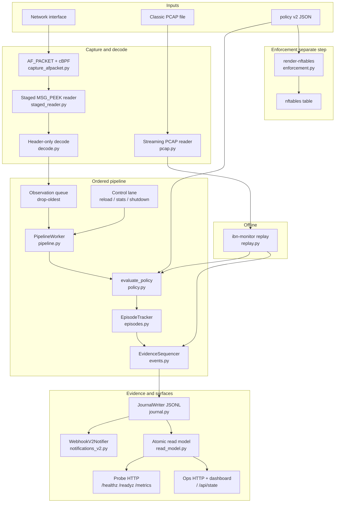

# ibn-monitor

**Intent-Based Continuous Traffic Monitor** — a Linux network sensor that evaluates live or offline IP traffic against declarative JSON policies, logs violations as JSONL, optionally notifies via webhook, exposes health/metrics and a small dashboard, and can render `action=drop` rules into an `nftables` forwarding table.

> Use this software only on networks and systems you own or are explicitly authorized to monitor.

## Features

| Capability | Detail |
|---|---|
| **Continuous capture (v1)** | IPv4/IPv6 header metadata via Scapy (`AsyncSniffer` or PCAP replay) |
| **Declarative policy** | V1: CIDRs, protocol, ports, severity, `alert` / `drop`. V2: explicit prohibited-flow assertions with enforcement disposition |
| **No payload capture** | Only IP/transport fields — never application body bytes |
| **Structured events** | V1 rotating JSONL + optional webhook; v2 schema-v2 episode evidence envelopes |
| **V2 classic PCAP replay** | Header-only streaming, event-time watermark, violation episodes (PCAPNG rejected) |
| **Live reload** | `SIGHUP` swaps v1 rules without stopping capture |
| **Observability** | `/healthz`, `/readyz`, Prometheus `/metrics`, `/api/state`, HTML dashboard at `/` |
| **Enforcement (optional)** | Render v1 `action=drop` rules to `inet ibn_monitor` for gateway `nftables` |

## Quick start

### Development (any OS)

```bash
python -m venv .venv
# Windows: .venv\Scripts\Activate.ps1
source .venv/bin/activate

pip install -e ".[dev]"
ibn-monitor validate --config config/policy.json
```

### Live capture (Linux)

Requires `libpcap` and `CAP_NET_RAW` (or root):

```bash
sudo apt-get install -y libpcap0.8 nftables
ip -brief link   # set sensor.interface in config/policy.json

sudo .venv/bin/ibn-monitor run --config config/policy.json
```

Events go to the path in `logging.file` (example policy: `/var/log/ibn-monitor/events.jsonl`).

### Without root

```bash
# Synthetic policy check (v1 exit 2 = match; v2 exit 1 = match, 2 = error)
ibn-monitor check --config config/policy.json \
  --source 10.20.5.14 --destination 10.50.10.8 \
  --protocol tcp --destination-port 5432

ibn-monitor check --config config/policy.v2.example.json \
  --source 10.20.5.14 --destination 10.50.10.8 \
  --protocol tcp --destination-port 5432 --format json

# V1 offline PCAP via Scapy path
python scripts/generate_test_pcap.py
ibn-monitor run --config config/policy.json --pcap test-traffic.pcap

# V2 classic-PCAP event-time replay (no Scapy)
ibn-monitor validate --config config/policy.v2.example.json --strict
ibn-monitor replay --config config/policy.v2.example.json \
  --pcap test-traffic.pcap --output build/replay-v2.jsonl --summary-output -

# Migrate unambiguous v1 policy to a v2 candidate (refuses overwrite)
ibn-monitor migrate-policy --config config/policy.json --output build/policy.v2.json \
  --sensor-id edge-gw-01 --topology gateway --capture-point wan=eth0
```

## Architecture

Live path is Linux-only with policy **version 2**. Offline analysis uses classic PCAP replay (any OS, no root). Enforcement is always a separate render/apply step — the sensor never drops packets.



**Live data flow (v2):** AF_PACKET → decode → Observation queue → `PipelineWorker` → `evaluate_policy` → `EpisodeTracker` → `EvidenceSequencer` → `JournalWriter` → webhook / ops snapshot / probe.

**Offline:** `ibn-monitor replay` streams classic PCAP through the same policy and episode path (no root). **Live:** Linux + policy version 2 only.

Modules under `src/ibn_monitor/` — no web framework, no ORM:

| Module | Role |
|---|---|
| `models.py` | Frozen domain types: v2 `Observation`/`PolicyRule`/episodes/evidence; transitional v1 `Rule`/`Event` for render/check |
| `config.py` | V1 `load_config` (render/migrate source); v2 `validate_v2_config`/`load_v2_config` + `runtime_identity_hash` |
| `capture.py` | `ObservationSource` + `MemoryObservationSource` (no Scapy) |
| `capture_afpacket.py` | Linux `AfPacketSource` (AF_PACKET / cBPF) |
| `cbpf.py` / `linux_packet.py` / `staged_reader.py` | Owned BPF templates, socket helpers, MSG_PEEK reader |
| `decode.py` / `pcap.py` / `policy.py` / `episodes.py` / `replay.py` | Pure v2 decode, PCAP, match, episodes, offline replay |
| `pipeline.py` / `ops_state.py` / `read_model.py` | Ordered worker, ops state, atomic operations projection |
| `probe.py` / `operations.py` / `dashboard.py` | Probe `/healthz` `/readyz` `/metrics`; ops `/` + `/api/state`; embedded SPA |
| `journal.py` / `notifications_v2.py` / `evidence_stub.py` | Durable journal, v2 webhooks, evidence writer seam |
| `monitor.py` | `LiveMonitor` composition root |
| `migration.py` / `cli.py` | v1→v2 migrate; validate/check/replay/run/render-nftables |
| `enforcement.py` | V1 `render_nftables` + v2 topology-aware `render_nftables_v2` (gateway/host; mirror rejected) |
| `engine.py` / `events.py` / `health.py` | V1 check/render helpers + legacy metrics |

See [docs/operator/runbook.md](docs/operator/runbook.md) for operations. Domain vocabulary: [CONTEXT.md](CONTEXT.md). Contributor conventions: [AGENTS.md](AGENTS.md).

## Requirements

| | |
|---|---|
| **Python** | 3.11+ |
| **Live capture / nftables** | Linux + `libpcap` + appropriate capabilities |
| **Dev / tests / PCAP** | Windows, macOS, or Linux |
| **Runtime deps** | `scapy`, `jsonschema` |

Capabilities: `CAP_NET_RAW` for capture; `CAP_NET_ADMIN` only when applying firewall rules.

## Policy model

**V1** `config/policy.json` is validated against packaged `ibn_monitor/policy.schema.json`. Schema owns structure (enums, ranges, ports-only-for-tcp/udp). `config.py` owns semantics (unique rule IDs, CIDR parse, frozen dataclasses).

**V2** example: `config/policy.v2.example.json`, schema `ibn_monitor/policy-v2.schema.json`. All match selectors are explicit; omitted CIDRs/ports are invalid. Canonical policy/config revisions are content hashes.

```json
{
  "version": 1,
  "sensor": { "interface": "eth0", "bpf_filter": "ip or ip6", "promiscuous": false },
  "logging": {
    "file": "/var/log/ibn-monitor/events.jsonl",
    "max_bytes": 10485760,
    "backup_count": 5
  },
  "health": { "enabled": true, "bind": "127.0.0.1", "port": 9108 },
  "notifications": {
    "webhook_url_env": "IBN_WEBHOOK_URL",
    "timeout_seconds": 3,
    "minimum_severity": "high",
    "deduplication_seconds": 60
  },
  "rules": [
    {
      "id": "DEV-TO-PROD-DB",
      "description": "Development systems must not connect directly to PostgreSQL in production",
      "enabled": true,
      "source_cidrs": ["10.20.0.0/16"],
      "destination_cidrs": ["10.50.10.8/32"],
      "protocol": "tcp",
      "destination_ports": [5432],
      "severity": "critical",
      "action": "drop"
    }
  ]
}
```

### Actions

| Action | Behavior |
|---|---|
| `alert` | Detect and log only |
| `drop` | Detect, log, **and** eligible for nftables rendering |

The live sensor **never** drops packets. Enforcement is a separate `render-nftables` (or apply script) step.

### Constraints

- Rule IDs must be unique.
- Non-empty `destination_ports` requires `protocol` `tcp` or `udp`.
- `notifications.webhook_url_env` is an **environment variable name**, never the URL itself.
- `SIGHUP` reloads **rules only**. Changes to `sensor`, `logging`, or `health` need a restart.

## CLI

```bash
ibn-monitor validate --config config/policy.json

ibn-monitor check --config config/policy.json \
  --source 10.20.5.14 --destination 10.50.10.8 \
  --protocol tcp --destination-port 5432
# exit 0 = no match, exit 2 = match

ibn-monitor run --config config/policy.json
ibn-monitor run --config config/policy.json --pcap traffic.pcap
ibn-monitor run --config config/policy.json --interface eth1

ibn-monitor render-nftables --config config/policy.json --output build/ibn-monitor.nft
```

| Make target | Command |
|---|---|
| `make test` | pytest + coverage |
| `make lint` | ruff check . |
| `make validate` | policy validate |
| `make check` | sample flow check |
| `make pcap` | generate + replay test PCAP |
| `make docker` | compose up --build -d |
| `make nftables` | render + `nft --check` |

## Webhook notifications

```bash
export IBN_WEBHOOK_URL='https://your-authorized-endpoint.example/events'
# Linux + sudo: preserve the secret
sudo --preserve-env=IBN_WEBHOOK_URL .venv/bin/ibn-monitor run --config config/policy.json
```

PowerShell:

```powershell
$env:IBN_WEBHOOK_URL = 'https://your-authorized-endpoint.example/events'
ibn-monitor run --config config/policy.json
```

- The POST body is the same JSON object as a JSONL log line.
- Delivery is asynchronous (daemon worker, queue max 1000).
- Events below `minimum_severity` are not sent; duplicates within `deduplication_seconds` (same rule + flow key) are suppressed. **Every** match is still written to the local log.
- Never commit webhook URLs.

## Health, metrics, and dashboard

Default bind: `127.0.0.1:9108`.

| Path | Purpose |
|---|---|
| `/` | Embedded dashboard (metrics, rules, recent violations; 3s refresh) |
| `/api/state` | JSON: metrics + rules + recent events |
| `/healthz` | Liveness |
| `/readyz` | Ready once capture is established (`503` until then) |
| `/metrics` | Prometheus text format |

```bash
curl http://127.0.0.1:9108/healthz
curl http://127.0.0.1:9108/readyz
curl http://127.0.0.1:9108/metrics
curl http://127.0.0.1:9108/api/state
```

> PowerShell: use `curl.exe` so you get the real curl binary (`curl` is an alias for `Invoke-WebRequest`).

Do not expose the health listener on untrusted networks without access control.

## Event format

One JSON object per line:

```json
{
  "schema_version": 1,
  "event_id": "9a790d64-b9d4-47e1-89bc-b469b72a3063",
  "event_type": "network_policy_violation",
  "observed_at": "2026-07-17T18:21:44.842911+00:00",
  "rule": {
    "id": "DEV-TO-PROD-DB",
    "description": "Development systems must not connect directly to PostgreSQL in production",
    "severity": "critical",
    "action": "drop"
  },
  "network": {
    "timestamp": "2026-07-17T18:21:44.842911+00:00",
    "interface": "eth0",
    "source": "10.20.5.14",
    "destination": "10.50.10.8",
    "protocol": "tcp",
    "source_port": 50000,
    "destination_port": 5432,
    "packet_length": 40,
    "tcp_flags": "S"
  }
}
```

## Docker

Live capture needs host networking and Linux capabilities:

```bash
mkdir -p data/logs
docker compose up --build -d
docker compose logs -f
```

Compose mounts `config/policy.json` read-only and writes logs to `./data/logs`. `IBN_WEBHOOK_URL` from the host environment is forwarded when set.

## systemd (Linux)

```bash
sudo ./scripts/install-systemd.sh
sudo systemctl status ibn-monitor
sudo journalctl -u ibn-monitor -f

# After editing policy rules only:
sudo systemctl reload ibn-monitor   # SIGHUP
```

Interface, BPF filter, log path, or health bind changes require a full restart.

## nftables enforcement (Linux)

Generate, validate, then apply:

```bash
ibn-monitor render-nftables \
  --config config/policy.json \
  --output build/ibn-monitor.nft

sudo nft --check --file build/ibn-monitor.nft
sudo nft --file build/ibn-monitor.nft
sudo nft list table inet ibn_monitor

# or
sudo ./scripts/apply-nftables.sh config/policy.json
```

Rendering works on any OS; applying requires Linux and `nft`.

**Operational notes**

- Generated chain hooks at **forward** — deploy on the gateway that sees the traffic.
- Only the `inet ibn_monitor` table is managed; other host firewall state is left alone.
- Validate in non-production first; keep console/out-of-band access before remote firewall changes.
- Persistence is distro-specific — wire the generated file into your platform’s nftables service.

## Testing

```bash
make test    # or: pytest
make lint    # or: ruff check .
```

- Shared fixtures: `tests/factories.py` (`rule`, `metadata`, `app_config`).
- `PacketSource` is injectable — `MonitorService` tests use an in-memory source (no Scapy mocking).
- Scapy route auto-load is disabled in `tests/conftest.py` for CI isolation.

## Security

See [SECURITY.md](SECURITY.md) for reporting and operational guidance. In short:

- Metadata only — no payload storage by design.
- A host sensor sees only traffic delivered to or mirrored to that host (TAP/SPAN/cloud mirror for broader visibility).
- Detection ≠ enforcement; apply firewall rules after controlled validation.
- Protect policy, logs, health bind, and webhook secrets.

## License

[GPL-2.0-only](LICENSE).
