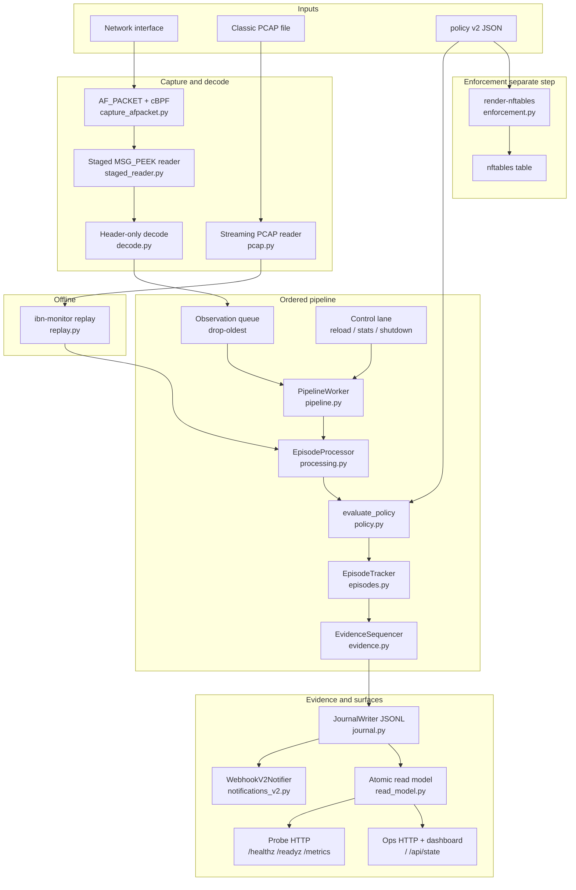

# Intent-Based Continuous Traffic Monitor

**Intent-Based Continuous Traffic Monitor** — a Linux network sensor that evaluates live or offline IP traffic against declarative JSON policies, logs violations as JSONL, optionally notifies via webhook, exposes health/metrics and a small dashboard, and can render `enforcement=nftables_drop_candidate` rules into a topology-aware `nftables` table.

> Use this software only on networks and systems you own or are explicitly authorized to monitor.

## Features

| Capability | Detail |
|---|---|
| **Continuous capture** | Windows: raw IPv4 (`SIO_RCVALL`). Linux: AF_PACKET. Offline: classic PCAP replay |
| **Declarative policy** | Version 2: explicit prohibited-flow assertions with enforcement disposition. Version 1 files are accepted only by `migrate-policy` |
| **No payload capture** | Only IP/transport fields — never application body bytes |
| **Structured events** | Schema-v2 violation-episode evidence envelopes in a durable JSONL journal + optional webhook |
| **V2 classic PCAP replay** | Header-only streaming, event-time watermark, violation episodes (PCAPNG rejected) |
| **Live reload** | `SIGHUP` swaps rules without stopping capture (other changes need a restart) |
| **Observability** | Probe `:9108` (`/healthz`, `/readyz`, `/metrics`); ops `:9109` (`/`, `/api/state`) |
| **Enforcement (optional)** | Render drop candidates to `inet ibn_monitor` (gateway: forward; host: input + output) |

## Quick start

### Development (any OS)

```bash
python -m venv .venv
# Windows: .venv\Scripts\Activate.ps1
source .venv/bin/activate

pip install -e ".[dev]"
ibn-monitor validate --config config/policy.v2.example.json
```

### Live capture (Windows — primary)

Run an elevated PowerShell (Administrator). Raw sockets use `SIO_RCVALL`
(no Scapy/Npcap dependency). Default policy:
`config/policy.v2.windows.json` (`interface: "auto"`).

```powershell
python -m venv .venv
.\.venv\Scripts\Activate.ps1
pip install -e ".[dev]"
New-Item -ItemType Directory -Force -Path data\logs | Out-Null
# Elevated:
ibn-monitor run
# or: ibn-monitor run --config config/policy.v2.windows.json --interface 192.168.1.10
```

Probe/ops on loopback: `http://127.0.0.1:9108/healthz`, `http://127.0.0.1:9109/`.

### Live capture (Linux)

Requires `CAP_NET_RAW` (or root) and AF_PACKET:

```bash
sudo apt-get install -y nftables
ip -brief link   # set capture_points[].interface in v2 policy

sudo .venv/bin/ibn-monitor run --config config/policy.v2.example.json
```

### Without root

```bash
# Synthetic policy check (exit 0 = no match, 1 = match, 2 = error)
ibn-monitor check --config config/policy.v2.example.json \
  --source 10.20.5.14 --destination 10.50.10.8 \
  --protocol tcp --destination-port 5432 --format json

# Classic-PCAP event-time replay
python scripts/generate_test_pcap.py
ibn-monitor validate --config config/policy.v2.example.json --strict
ibn-monitor replay --config config/policy.v2.example.json \
  --pcap test-traffic.pcap --output build/replay-v2.jsonl --summary-output -

# Migrate an unambiguous version 1 policy to a v2 candidate (refuses overwrite)
ibn-monitor migrate-policy --config config/policy.json --output build/policy.v2.json \
  --sensor-id edge-gw-01 --topology gateway --capture-point wan=eth0
```

## Architecture

Live capture runs on Windows or Linux with policy **version 2**. Offline analysis uses classic PCAP replay (any OS, no root). Enforcement is always a separate render/apply step — the sensor never drops packets.


```mermaid
flowchart TD
    subgraph inputs [Inputs]
        NIC[Network interface]
        PCAP[Classic PCAP file]
        POLCFG[policy v2 JSON]
    end

    subgraph capture [Capture and decode]
        AFP[AF_PACKET + cBPF<br/>capture_afpacket.py]
        STG[Staged MSG_PEEK reader<br/>staged_reader.py]
        DEC[Header-only decode<br/>decode.py]
        PCP[Streaming PCAP reader<br/>pcap.py]
    end

    subgraph pipeline [Ordered pipeline]
        OQ[Observation queue<br/>drop-oldest]
        CTL[Control lane<br/>reload / stats / shutdown]
        WORK[PipelineWorker<br/>pipeline.py]
        PROC[EpisodeProcessor<br/>processing.py]
        MATCH[evaluate_policy<br/>policy.py]
        EP[EpisodeTracker<br/>episodes.py]
        SEQ[EvidenceSequencer<br/>evidence.py]
    end

    subgraph outputs [Evidence and surfaces]
        JRN[JournalWriter JSONL<br/>journal.py]
        WH[WebhookV2Notifier<br/>notifications_v2.py]
        RM[Atomic read model<br/>read_model.py]
        PROBE[Probe HTTP<br/>/healthz /readyz /metrics]
        OPS[Ops HTTP + dashboard<br/>/ /api/state]
    end

    subgraph offline [Offline]
        RPL[ibn-monitor replay<br/>replay.py]
    end

    subgraph enforce [Enforcement separate step]
        RNF[render-nftables<br/>enforcement.py]
        NFT[nftables table]
    end

    NIC --> AFP --> STG --> DEC --> OQ
    PCAP --> PCP --> RPL
    RPL --> PROC
    POLCFG --> MATCH
    POLCFG --> RNF
    OQ --> WORK
    CTL --> WORK
    WORK --> PROC --> MATCH --> EP --> SEQ
    SEQ --> JRN
    JRN --> WH
    JRN --> RM
    RM --> PROBE
    RM --> OPS
    RNF --> NFT
```

**Live data flow (v2):** AF_PACKET → decode → Observation queue → `PipelineWorker` → `EpisodeProcessor` (`evaluate_policy` → `EpisodeTracker` → `EvidenceSequencer`) → `JournalWriter` → webhook / ops snapshot / probe.

**Offline:** `ibn-monitor replay` streams classic PCAP through the same policy and episode path (no root).

Modules under `src/ibn_monitor/` — no web framework, no ORM:

| Module | Role |
|---|---|
| `models.py` | Frozen domain types: `Observation`, `PolicyRule`, episodes, evidence envelopes |
| `config.py` | V2 `validate_v2_config`/`load_v2_config` (one builder per section; defaults live on the dataclasses), `ConfigSource` (file + `--interface` override, same on reload), `runtime_identity_hash`, `is_loopback_host` |
| `capture.py` | `ObservationSource` + `MemoryObservationSource` (no Scapy) |
| `capture_afpacket.py` | Linux `AfPacketSource` (AF_PACKET / cBPF) |
| `cbpf.py` / `linux_packet.py` / `staged_reader.py` | Owned BPF templates, socket helpers, MSG_PEEK reader |
| `decode.py` / `pcap.py` / `policy.py` / `episodes.py` | Pure v2 decode, PCAP, match, episode tracking |
| `processing.py` | `EpisodeProcessor`: Observation/tick/reload/shutdown → sequenced evidence envelopes (no I/O); owns the reload contract |
| `replay.py` | Offline replay: PCAP watermark ordering around the Episode processor |
| `pipeline.py` / `ops_state.py` / `read_model.py` | Threaded worker (queues, control lane) around the Episode processor; ops state machine; `ReadModel.publish` — one atomic projection read by probe and ops HTTP |
| `probe.py` / `operations.py` / `dashboard.py` | Probe `/healthz` `/readyz` `/metrics`; ops `/` + `/api/state`; embedded SPA |
| `journal.py` / `notifications_v2.py` | Durable journal (`JournalWriter` satisfies `EvidenceWriter`), v2 webhooks (`V2Notifier.stats()`) |
| `monitor.py` | `LiveMonitor` composition root |
| `migration.py` / `cli.py` | Sole version 1 reader (v1→v2 migrate); validate/check/replay/run/render-nftables |
| `enforcement.py` | Topology-aware `render_nftables_v2` (gateway/host; mirror rejected) |
| `evidence.py` | `EvidenceSequencer` (sole sequence allocator), canonical `serialize_evidence`, `EvidenceWriter` seam + `MemoryEvidenceWriter` |

See [docs/operator/runbook.md](docs/operator/runbook.md) for operations. Domain vocabulary: [CONTEXT.md](CONTEXT.md). Contributor conventions: [AGENTS.md](AGENTS.md).

## Requirements

| | |
|---|---|
| **Python** | 3.11+ |
| **Live capture** | Windows (Administrator) or Linux (`CAP_NET_RAW`) |
| **Dev / tests / PCAP** | Windows, macOS, or Linux |
| **Runtime deps** | `jsonschema` |

Capabilities: `CAP_NET_RAW` for capture; `CAP_NET_ADMIN` only when applying firewall rules.

## Policy model

Policies are **version 2**: example `config/policy.v2.example.json`, schema `ibn_monitor/policy-v2.schema.json`. All match selectors are explicit; omitted CIDRs/ports are invalid. Canonical policy/config revisions are content hashes.

```json
{
  "version": 2,
  "sensor": {
    "id": "edge-gw-01",
    "topology": "gateway",
    "capture_points": [
      { "name": "wan", "interface": "eth0", "direction": "inbound", "promiscuous": false }
    ]
  },
  "rules": [
    {
      "id": "DEV-DB",
      "description": "development must not reach production database",
      "enabled": true,
      "match": {
        "source_cidrs": ["10.20.0.0/16"],
        "destination_cidrs": ["10.50.10.8/32"],
        "protocol": "tcp",
        "destination_ports": [5432]
      },
      "severity": "critical",
      "enforcement": "nftables_drop_candidate"
    }
  ]
}
```

Version 1 policy files (`config/policy.json`) are accepted only by `migrate-policy`; every other command rejects them. See [`docs/operator/migration-and-events.md`](docs/operator/migration-and-events.md).

### Enforcement disposition

| `enforcement` | Behavior |
|---|---|
| `none` | Detect and record evidence only |
| `nftables_drop_candidate` | Detect, record, **and** eligible for `render-nftables` |

The live sensor **never** drops packets. Enforcement is a separate `render-nftables` (or apply script) step.

### Constraints

- Rule IDs must be unique.
- `destination_ports` only for `tcp` / `udp` (list or `"any"`).
- `notifications.webhook_url_env` is an **environment variable name**, never the URL itself.
- `SIGHUP` reloads **rules only**. Any other change (sensor, processing, episodes, journal, http, notifications) is reported as `restart_required`.

## CLI

```bash
ibn-monitor validate --config config/policy.v2.example.json --strict

ibn-monitor check --config config/policy.v2.example.json \
  --source 10.20.5.14 --destination 10.50.10.8 \
  --protocol tcp --destination-port 5432
# exit 0 = no match, 1 = match, 2 = error

ibn-monitor run --config config/policy.v2.example.json
ibn-monitor run --config config/policy.v2.example.json --interface eth1

ibn-monitor replay --config config/policy.v2.example.json --pcap traffic.pcap \
  --output build/replay.jsonl

ibn-monitor render-nftables --config config/policy.v2.example.json --output build/ibn-monitor.nft

ibn-monitor migrate-policy --config config/policy.json --output build/policy.v2.json \
  --sensor-id edge-gw-01 --topology gateway --capture-point wan=eth0
```

| Make target | Command |
|---|---|
| `make test` | pytest + coverage |
| `make lint` | ruff check . |
| `make validate` | strict policy validate |
| `make check` | sample flow check |
| `make replay-v2` | generate + replay test PCAP |
| `make docker` | `docker compose up --build -d` (see `docs/operator/docker.md`) |
| `make nftables` | render nftables ruleset |
| `make release-check` | lint + tests + microbench + validate + replay + render + wheel |

## Webhook notifications

```bash
export IBN_WEBHOOK_URL='https://your-authorized-endpoint.example/events'
# Linux + sudo: preserve the secret
sudo --preserve-env=IBN_WEBHOOK_URL .venv/bin/ibn-monitor run --config config/policy.v2.example.json
```

PowerShell:

```powershell
$env:IBN_WEBHOOK_URL = 'https://your-authorized-endpoint.example/events'
ibn-monitor run
```

- The POST body is the same evidence envelope as the journal line.
- Only episode `start` and `close` at or above `minimum_severity` are sent; every envelope is still journaled.
- Delivery is asynchronous with bounded retries (`max_attempts`, `max_elapsed_seconds`).
- Never commit webhook URLs.

## Probe and operations HTTP (v2)

Live runs split HTTP into two loopback listeners.

### Probe (default `127.0.0.1:9108`)

| Path | Purpose |
|---|---|
| `/healthz` | Liveness (`200` while the process is up, including degraded) |
| `/readyz` | Ready only when operational `state=ready` (`503` otherwise) |
| `/metrics` | Prometheus text format |

```bash
curl -sS http://127.0.0.1:9108/healthz
curl -sS http://127.0.0.1:9108/readyz
curl -sS http://127.0.0.1:9108/metrics
```

### Operations (default `127.0.0.1:9109`)

| Path | Purpose |
|---|---|
| `/` | Embedded dashboard (rules, episodes, recent evidence; 3s refresh) |
| `/api/state` | Atomic JSON snapshot from `ReadModel.view()` |

```bash
curl -sS http://127.0.0.1:9109/
curl -sS http://127.0.0.1:9109/api/state
```

> PowerShell: use `curl.exe` so you get the real curl binary (`curl` is an alias for `Invoke-WebRequest`).

Non-loopback **operations** bind requires `http.operations.allow_non_loopback=true`
and an authenticated reverse proxy or SSH tunnel. Do not expose probe or
operations listeners on untrusted networks without access control.

Snapshot contract (nested fields, truncation, example JSON):
[`docs/operator/ops-state-api.md`](docs/operator/ops-state-api.md).
Day-2 operator flow: [`docs/operator/runbook.md`](docs/operator/runbook.md).

## Event format

Live and replay emit schema-v2 evidence envelopes, one JSON object per line.
Field reference: [`docs/operator/migration-and-events.md`](docs/operator/migration-and-events.md).

## Docker (Windows Docker Desktop only)

Compose targets **Windows + Docker Desktop** (Linux containers, bridge network,
published ports). Live AF_PACKET capture is **not** available here — use
systemd on a real Linux host for production sensing. Operator guide:
[`docs/operator/docker.md`](docs/operator/docker.md).

```powershell
Copy-Item .env.example .env -ErrorAction SilentlyContinue
New-Item -ItemType Directory -Force -Path data\logs, data\lib | Out-Null
docker compose up --build -d
docker compose logs -f monitor

curl.exe -sS http://127.0.0.1:9108/healthz
curl.exe -sS http://127.0.0.1:9109/api/state
```

| Piece | Detail |
|---|---|
| Ports | `9108` probe, `9109` ops/dashboard (published to Windows host) |
| Policy | `config/policy.v2.docker.json` binds `0.0.0.0` for Desktop port maps |
| Journal | `.\data\logs` → `/var/log/ibn-monitor` |
| Live capture | Degraded on Desktop (`/readyz` 503 expected) |
| Offline | `docker compose --profile tools run --rm validate` |
| Replay | `docker compose --profile replay run --rm replay` |

## systemd (Linux)

```bash
sudo ./scripts/install-systemd.sh
sudo systemctl status ibn-monitor
sudo journalctl -u ibn-monitor -f

# After editing policy rules only:
sudo systemctl reload ibn-monitor   # SIGHUP
```

Sensor, journal, HTTP, or notification changes require a full restart.

## nftables enforcement (Linux)

Generate, validate, then apply:

```bash
ibn-monitor render-nftables \
  --config config/policy.v2.example.json \
  --output build/ibn-monitor.nft

sudo nft --check --file build/ibn-monitor.nft
sudo nft --file build/ibn-monitor.nft
sudo nft list table inet ibn_monitor

# or
sudo ./scripts/apply-nftables.sh config/policy.v2.example.json
```

Rendering works on any OS; applying requires Linux and `nft`.

**Operational notes**

- `gateway` topology hooks **forward**; `host` hooks **input** + **output**; `mirror` refuses to render.
- Only the `inet ibn_monitor` table is managed; other host firewall state is left alone.
- Validate in non-production first; keep console/out-of-band access before remote firewall changes.
- Persistence is distro-specific — wire the generated file into your platform’s nftables service.

## Testing

```bash
make test    # or: pytest
make lint    # or: ruff check .
```

- Shared fixtures: `tests/factories.py` (`policy_rule`, `observation`, `v2_config`).
- `ObservationSource` is injectable — `LiveMonitor` tests use `MemoryObservationSource`.
- Privileged Linux tests: `make test-linux-raw`.

## Security

See [SECURITY.md](SECURITY.md) for reporting and operational guidance. In short:

- Metadata only — no payload storage by design.
- A host sensor sees only traffic delivered to or mirrored to that host (TAP/SPAN/cloud mirror for broader visibility).
- Detection ≠ enforcement; apply firewall rules after controlled validation.
- Protect policy, logs, health bind, and webhook secrets.

## License

[GPL-2.0-only](LICENSE).
