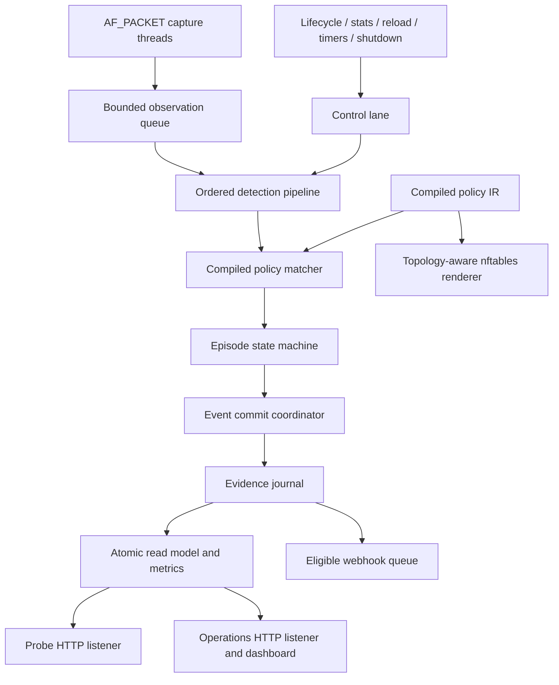

# ibn-monitor v2 Architecture Design

Status: approved umbrella design
Date: 2026-07-23

## Purpose

ibn-monitor v2 is a detection-first Linux network sensor. It observes IP and transport-header metadata, evaluates explicit prohibited-flow assertions, records trustworthy local evidence, exposes operational state, optionally notifies a webhook, and renders topology-aware nftables artifacts for a separate privileged workflow.

This document is the approved whole-system contract. Delivery is intentionally split into focused follow-on specifications. A follow-on spec may refine implementation details, but it must not silently weaken or contradict this contract.

## Context

Version 1 is a small Python/Scapy application with packet-shaped violation events, synchronous policy evaluation and event logging in the capture callback, one readiness boolean, one HTTP listener, and a renderer that always targets an nftables forwarding chain. It also treats omitted or empty selectors as wildcards and labels render-eligible rules as `action=drop` even though the sensor never drops traffic.

Version 2 corrects those semantic and operational ambiguities. It is a clean policy and event-schema break, not an incremental extension of version 1.

## Goals

- Make passive detection and honest local evidence the primary product contract.
- Support `gateway`, `mirror`, and `host` as explicit, tested topology profiles.
- Represent a violation as a bounded flow episode rather than one event per packet.
- Quantify capture, kernel, processing, journal, notification, and decode degradation.
- Keep rule meaning deterministic, auditable, and equivalent to rendered nftables predicates when enforcement is requested.
- Preserve a capability-limited, single-process deployment with clear internal ownership.
- Sustain 10,000 observations per second across 100 enabled rules on the documented 2-vCPU/512-MB Linux reference host, with no steady-state application drops and p99 episode-start latency below one second.
- Retain cross-platform development, validation, checking, migration, and classic-PCAP replay.

## Non-goals

- Line-rate capture at arbitrary traffic and rule counts.
- Payload capture, payload inspection, stream reassembly, or application-protocol enrichment.
- TCP session reconstruction or IP fragment reassembly.
- Automatic firewall application or continuous firewall reconciliation.
- Centralized policy distribution, signed policies, or a write-capable web control plane.
- Long-term incident storage, search, acknowledgement, or case management.
- PCAPNG replay in the first v2 release.
- Wi-Fi monitor mode or arbitrary non-Ethernet live-link support.

## Product boundary

Every enabled rule is a prohibited-flow assertion. A match means the observed traffic violates that assertion. All matching rules are reported independently; rule order, priority, and hidden conflict resolution do not exist.

The live sensor detects and records. An enforcement disposition means that the same assertion is eligible for deterministic nftables rendering; it does not mean the observed packet was dropped. Applying and rolling back an artifact is owned by separate privileged automation.

The sensor counts exact capture observations and observed bytes. It never claims these are unique network packets because a mirror or multiple capture points can expose duplicate copies. Episode identity excludes capture point so those copies converge on one episode, while totals retain a per-capture-point breakdown.

Every configured capture point is required coverage. If any point is unavailable or degraded, aggregate readiness is degraded even if other points continue observing.

## Architecture

The selected architecture is a single non-root process composed of deep modules and direct typed interfaces. It does not introduce a generic internal event bus or multiple cooperating processes.



### Module ownership

| Module | Responsibility |
|---|---|
| `models.py` | Frozen observations, policies, episode snapshots, evidence envelopes, source states, diagnostics, and operational snapshots. |
| `config.py` | Load schema v2, canonicalize effective configuration, perform semantic validation, and calculate config/policy revisions. |
| `migration.py` | Convert unambiguous v1 fields and report choices that require an operator. Never overwrite input. |
| `capture.py` | `ObservationSource` protocol, AF_PACKET lifecycle, capture-point sockets, cBPF attachment, timestamps, statistics, and retries. |
| `decode.py` | Bounded, header-only Ethernet/VLAN/IP/transport decoding with explicit complete/partial outcomes. |
| `pcap.py` | Streaming classic-PCAP reader and supported datalink adapters. |
| `policy.py` | Immutable compiled-policy intermediate representation shared by matching and rendering. |
| `engine.py` | Pure all-match evaluation of complete or partial observations against compiled predicates. |
| `episodes.py` | Deterministic start/progress/close state machine, event-time watermark behavior, bounds, and eviction. |
| `pipeline.py` | Observation/control queues, ordered worker, timers, transactional policy reload, and bounded shutdown. |
| `journal.py` | Sequence allocation, JSONL append/rotation/fsync, emergency buffering, retry, and recovery gaps. |
| `notifications.py` | Null/webhook notifier, eligibility, retry/backoff, idempotency, and bounded shutdown drain. |
| `read_model.py` | Coherent immutable operations snapshot and bounded-cardinality metrics projection. |
| `health.py` | Minimal probe and operations HTTP listeners over the read model. |
| `dashboard.py` | Embedded, read-only operations UI with no external network assets or write controls. |
| `enforcement.py` | Translate the compiled policy into deterministic topology-specific nftables artifacts. |
| `monitor.py` | Process lifecycle and dependency composition for live operation. |
| `cli.py` | `validate`, `migrate-policy`, `check`, `replay`, `render-nftables`, and live `run` composition. |

This split is directional. Capture does not know policy; episodes do not know files or webhooks; HTTP does not query mutable runtime components; the renderer does not inspect live state.

### Thread ownership

- The main thread installs signal handlers and owns process lifecycle.
- Each capture point has one socket-owning capture thread that receives, decodes, and non-blockingly enqueues observations.
- One processing worker owns policy-generation ordering, episode state, event sequencing, journal writes, and read-model updates.
- One webhook worker owns outbound HTTP delivery.
- HTTP server threads only read immutable snapshots.
- No other component writes the evidence journal or mutates episode state.

Traffic uses a bounded drop-oldest queue. Lifecycle, capture statistics, reload, timer, and shutdown messages use a separate small control lane whose latest state can be coalesced. Traffic cannot starve source failure or shutdown handling.

## Configuration and policy v2

Execution commands require `version: 2`. Schema structure and ranges live in the packaged JSON Schema. Semantic validation lives in `config.py` and returns ordered diagnostics with stable codes and JSON paths.

### Sensor configuration

The sensor requires:

- A stable operator-managed `sensor.id`.
- `sensor.topology`: `gateway`, `mirror`, or `host`.
- One or more capture points, each with a stable logical name and OS interface.
- Direction: `inbound`, `outbound`, or `both`.
- Promiscuous-mode intent.

Profile defaults are:

| Topology | Direction | Promiscuous mode | Enforcement chains |
|---|---|---|---|
| `gateway` | `inbound` | `false` | `forward` |
| `mirror` | `inbound` | required `true` | rendering rejected |
| `host` | `both` | `false` | `input` and `output` |

Gateway and host capture points may explicitly override promiscuous mode. Direction may be explicitly overridden for all profiles. Effective settings are included in sensor-start and source-generation evidence.

### Processing defaults

| Setting | Default | Allowed range |
|---|---:|---:|
| Observation queue capacity | 10,000 | 1,000–1,000,000 |
| Active episode capacity | 10,000 | 100–1,000,000 |
| Episode idle close | 30 seconds | 1–3,600 seconds |
| Episode progress checkpoint | 60 seconds | 1–3,600 seconds |
| Replay lateness watermark | 2 seconds | 0–60 seconds |
| Queue recovery cooldown | 30 seconds | 0–300 seconds |
| Graceful observation drain | 10 seconds | 1–60 seconds |
| Webhook shutdown drain | 5 seconds | 0–60 seconds |

These settings are global and validated within documented safe ranges. Rules cannot override resource limits or lifecycle timing.

### Rule shape

Rules use a required `match` object and explicit enforcement disposition:

```json
{
  "id": "DEV-TO-PROD-DB",
  "description": "Development systems must not connect to production PostgreSQL",
  "enabled": true,
  "match": {
    "source_cidrs": ["10.20.0.0/16"],
    "destination_cidrs": ["10.50.10.8/32"],
    "protocol": "tcp",
    "destination_ports": [5432]
  },
  "severity": "critical",
  "enforcement": "nftables_drop_candidate"
}
```

Rules have the following constraints:

- Source and destination CIDR arrays are required and non-empty.
- `0.0.0.0/0` and `::/0` explicitly mean any address in their family.
- Protocol is required: `any`, `tcp`, `udp`, or `icmp`.
- TCP/UDP rules require a non-empty destination-port list or the literal `"any"`.
- ICMP and any-protocol rules forbid a destination-port field.
- Severity is required: `low`, `medium`, `high`, or `critical`.
- Enforcement is required: `none` or `nftables_drop_candidate`.
- Rule IDs are unique.
- Impossible source/destination address-family intersections are errors.
- An enforcement candidate that cannot be translated exactly for its topology is an error.
- Overlapping assertions are warnings because every match remains independently meaningful.

Schema resource limits are part of the security boundary:

- 1–32 capture points and 1–1,000 rules.
- Sensor IDs, capture-point names, and rule IDs are 1–64 characters matching `[A-Za-z0-9][A-Za-z0-9_.-]*`.
- Rule descriptions are 1–512 UTF-8 characters with control characters rejected.
- Each source/destination CIDR list contains 1–256 entries.
- Each concrete destination-port list contains 1–1,024 unique ports.
- A serialized evidence line may not exceed 256 KiB; validation and event construction prevent over-size output rather than truncating evidence.

Validation errors block run, replay, check, and render. Warnings are visible but do not block unless `--strict` is used. Human and machine-readable diagnostic formats contain the same codes and locations.

### Revisions and reload

The policy revision is a SHA-256 digest of canonical effective rule data, including normalized CIDRs, sorted/deduplicated ports, descriptions, severity, enabled state, and enforcement disposition. The full configuration revision also covers runtime settings.

SIGHUP performs a transactional policy-only reload:

1. Load and validate the entire file.
2. Reject the reload if any restart-only effective setting differs.
3. Compile the new immutable policy and calculate its revision.
4. If the policy revision is unchanged, journal `policy_reload_noop` and leave episodes untouched.
5. Otherwise, close active episodes under the old revision with reason `policy_reload`.
6. Journal the policy transition.
7. Atomically replace the compiled-policy snapshot.

Any failure keeps the old policy active and journals/reports the failed attempt without changing readiness unless the existing core path is also unhealthy.

## Observation and decoding model

A frozen observation contains:

- Capture timestamp and live monotonic arrival timestamp.
- Stable sensor ID, source-generation ID, capture-point name, OS interface, and observed direction.
- Wire length without payload contents.
- IP version, source, destination, and resolved transport protocol when known.
- Source/destination port, TCP flags, and ICMP type/code when known.
- A field-presence mask.
- Decode outcome and a bounded reason code.

The decoder never exposes raw frame bytes beyond the capture module and never copies payload into an application-owned buffer. The AF_PACKET reader uses staged `MSG_PEEK` calls to read only the bytes required to determine successive header lengths, then consumes exactly the computed L2/L3/L4 span. `PACKET_AUXDATA.tp_len` supplies original wire size after the cBPF snapshot bound; `MSG_TRUNC` detects receive-buffer truncation.

Safety limits are fixed for the first v2 release:

- At most 512 header bytes.
- Ethernet live capture.
- Ethernet, raw IP, Linux cooked v1, and Linux cooked v2 classic-PCAP datalinks.
- At most two nested VLAN tags.
- At most eight IPv6 extension headers within the byte bound.
- No fragment reassembly.

Malformed, truncated, unsupported, or over-limit headers produce partial observations when trustworthy source/destination data is available; otherwise they produce an undecodable observation outcome. They never terminate the source.

A rule evaluates a partial observation only when every field constrained by that rule is present. Unknown fields are neither wildcards nor presumed matches. A matched partial observation uses a completeness-aware episode key so it cannot collide with a complete five-tuple.

## Compiled policy and matching

Schema-valid rules compile into an immutable intermediate representation grouped by IP family and protocol. CIDRs and port sets are normalized once. The compiled object carries the policy revision and exposes predicates suitable for both packet evaluation and nftables translation.

The matcher is pure: given a compiled policy and observation, it returns all matching compiled rules without I/O or global state. Matching remains semantically equivalent to v1's negative assertion model but removes implicit wildcards.

Detection and rendering use the same compiled predicates. Shared test vectors and property tests verify equivalence. The renderer must reject rather than approximate unsupported semantics.

## Violation episodes

An episode key contains:

- Policy revision and rule ID.
- IP version, source, destination, and protocol when present.
- Source and destination ports when present.
- ICMP type/code when present.
- Field-presence mask and decode reason for partial observations.

Capture point is not part of the key. Each episode stores exact total observation count, observed wire bytes, and per-capture-point counts.

The deterministic state machine supports:

- `observe(matched_observation)` returning zero or more frozen transition events.
- `advance_live(monotonic_time)` for live idle/progress transitions.
- `advance_watermark(event_time)` for replay transitions.
- `close_all(reason)` for reload, shutdown, source exhaustion, or explicit failure boundaries.
- A bounded immutable snapshot for the operations read model.

Lifecycle behavior is:

- First match emits `start` immediately.
- An active episode emits `progress` every configured interval.
- An idle episode emits `close` after the idle timeout.
- Capacity pressure evicts the least-recently-observed episode and emits a truncated `close` with reason `capacity_evicted`.
- Reload closes with `policy_reload` before the new policy becomes active.
- Replay EOF closes with `source_exhausted`.
- Graceful stop closes with `shutdown`.

Live lifecycle uses monotonic time so wall-clock corrections do not create false timeouts. Evidence retains wall-clock observation timestamps. Replay uses PCAP event time and a two-second watermark. Observations beyond the watermark remain evaluated, are marked late, increment a metric, and cannot rewrite already finalized history.

## Evidence envelope

All JSONL and webhook data uses event schema version 2. There is no parallel per-packet legacy stream.

Every envelope includes:

- Schema version and typed event name.
- Opaque event ID.
- Stable sensor ID, random boot ID, and monotonic sequence within that boot.
- Emission timestamp and policy revision where applicable.
- A frozen typed payload.

Violation episode payloads include episode ID, phase (`start`, `progress`, or `close`), rule metadata, normalized flow/completeness data, first/last observation times, exact counts, per-point counts, duration, and optional close reason.

System payloads cover:

- Sensor start, stopping, clean stop, and unclean previous boot.
- Policy load, reload success, and reload failure.
- Capture-point established, failed, retrying, recovered, and stopped transitions.
- Kernel/application queue loss, decode degradation, episode eviction, journal failure/recovery, and coverage gaps.
- Notification exhaustion and recovery summaries.

Diagnostic application logs remain separate and must not substitute for sequenced evidence.

## Raw live capture

Each capture point owns one `AF_PACKET/SOCK_RAW` socket and thread. Startup:

1. Resolves and validates the configured interface and link type.
2. Binds the socket to the interface index.
3. Applies promiscuous membership when configured.
4. Enables nanosecond kernel timestamps and VLAN auxiliary data.
5. Requests the configured receive-buffer size without requiring `CAP_NET_ADMIN`.
6. Attaches and locks a generated classic-BPF template.
7. Verifies `PACKET_STATISTICS` availability.
8. Emits an established source-generation transition before observations.

The owned cBPF template admits supported IPv4/IPv6 Ethernet/VLAN shapes, enforces direction through packet type, and bounds the prefix available to the header reader. Free-form BPF configuration is removed.

Capture threads use `recvmsg` rather than a memory-mapped packet ring. This choice is gated by the reference performance test. TPACKET_V3 and AF_XDP are future replacements only if measured requirements justify them.

`PACKET_STATISTICS` reads reset socket counters, so the source accumulates them into monotonic received/drop totals. The sensor reports socket/kernel drops; it does not claim visibility into every NIC or switch hardware drop counter.

When a capture point fails or disappears, its source generation ends, readiness becomes degraded, and other points continue. The source detects socket failure, interface-index replacement, administrative-down state, and lost running/carrier state through periodic Linux interface-flag checks. It retries the configured interface name using exponential backoff from one to thirty seconds. A reopened socket gets a new source-generation ID. Traffic silence never indicates source failure.

## Queueing, overload, and operational state

The observation queue is bounded and non-blocking. When full, the oldest queued observation is evicted so detection stays near real time. Loss is accumulated by capture point. The pipeline enters degraded state immediately and remains degraded until utilization is healthy for the 30-second cooldown. A coverage-gap event describes the interval and counts once journal commitment is possible.

The operational state is one of `starting`, `ready`, `degraded`, or `stopping`, plus a bounded set of concurrent reason codes. Core degradation reasons include:

- A required capture point is unavailable.
- Kernel or application drops exceed the defined zero-drop steady-state contract.
- The processing worker is unavailable.
- The journal is unavailable or its emergency buffer has lost events.
- No valid compiled policy is active.
- Graceful shutdown is in progress.

Webhook failure is visible but does not degrade core readiness. Quiet traffic does not degrade readiness.

## Replay

`replay` is separate from live `run`. It streams classic PCAP without root, preserves microsecond or nanosecond capture timestamps, validates file endianness and datalink type before producing evidence, and never loads the complete file into memory.

Replay uses the same decoder, compiled matcher, episode state machine, and event envelopes as live capture. Dashboard and webhooks are disabled by default. EOF closes every active episode and emits a machine-readable summary containing observation, decode, match, episode, and late-arrival totals.

PCAPNG and unsupported datalinks fail with an actionable error before partial output. Conversion is documented as an external operator step, not invoked automatically.

## Evidence journal

The local journal is a bounded authoritative record within configured retention, not a permanent archive. External shipping owns long-term retention.

The journal uses one append-only writer independent of Python's diagnostic logging configuration. It:

- Allocates sequence numbers in processing order.
- Appends a complete, size-bounded JSON object plus newline.
- Fsyncs within one second of a healthy write and at clean shutdown.
- Rotates atomically under configured size/time and backup limits.
- Preserves sensor/boot/sequence identity across rotated files.
- Examines the previous tail at startup to identify an unclean boot.

Healthy crash loss is bounded by the one-second fsync interval. During journal failure, readiness is degraded and events enter an emergency buffer bounded by both 1,000 events and 8 MiB. The writer retries. Buffer overflow evicts oldest evidence and accumulates a gap summary. On recovery, it writes surviving buffered events followed by a recovery/coverage-gap event. Diagnostic stderr and metrics remain available throughout the failure.

An event must be accepted by the journal or emergency buffer before it updates the operations projection or enters the notifier queue. Fan-out is never parallel best effort.

## Notifications

Webhook eligibility is fixed for v2:

- Violation episode `start` and `close` events.
- Operational `degraded`, `coverage_gap`, and `recovered` transitions.
- No progress checkpoints, routine startup events, or successful reload chatter.

Violation notifications still honor the configured minimum severity. Critical operational transitions bypass that severity threshold.

The notifier uses a bounded 1,000-event queue and retries transient failures with exponential backoff, jitter, and `Retry-After`. Defaults are five attempts within sixty seconds. Event ID is sent as `Idempotency-Key`. The worker drains for up to five seconds during graceful shutdown, then records undelivered counts. There is no persistent outbox; the local journal remains authoritative.

The configured URL is read from the named environment variable at process start. HTTPS with normal certificate verification is required. URLs containing embedded credentials or fragments are rejected. Cross-origin redirects are rejected. Plain HTTP is accepted only for a loopback address when an explicit insecure-development setting is enabled. Secrets and full URLs are never logged or exposed through HTTP state.

## HTTP and dashboard

HTTP is split by trust boundary.

The probe listener exposes only:

- `/healthz`: HTTP 200 for a viable process, including recoverable degraded states; HTTP 500 for an irrecoverably dead processing worker or equivalent condition requiring supervisor restart.
- `/readyz`: HTTP 200 only in `ready`, otherwise 503.
- `/metrics`: Prometheus text with configuration-bounded labels.

The operations listener exposes:

- `/`: embedded read-only dashboard.
- `/api/state`: one coherent immutable snapshot containing operational state, source status, queue/journal/notifier status, policy revision and rules, the 100 most recently updated active episode summaries, the 100 most recent evidence events, total counts, and explicit truncation indicators.

The operations listener defaults to loopback and has no built-in authentication. Remote access requires SSH tunneling or an authenticated reverse proxy. It cannot bind beyond loopback without an explicit risk acknowledgement. Responses use strict content-type, no-cache, frame, MIME-sniffing, referrer, and content-security headers. The dashboard uses no third-party assets and has no state-changing routes.

Prometheus labels may contain only validated capture-point names, rule IDs, phase/reason codes, and other small enums. Endpoints, ports, episode IDs, error strings, and webhook destinations never become labels.

## Enforcement

The renderer consumes the compiled-policy IR and only rules with `nftables_drop_candidate`.

- Gateway topology renders the owned forwarding chain.
- Host topology renders equivalent input and output chains.
- Mirror topology rejects rendering.

Output is deterministic and sorted. It contains policy revision and topology but no volatile generation timestamp. Re-rendering the same effective policy produces byte-identical output. The artifact owns only the `inet ibn_monitor` table and is designed for idempotent atomic replacement without modifying other tables.

Python does not invoke `nft`. External privileged automation must:

1. Back up the currently owned table state.
2. Render the candidate artifact as an unprivileged operation.
3. Run `nft --check`.
4. Apply one atomic batch.
5. Verify the installed table and policy revision.
6. Roll back to the prior snapshot if application or verification fails.

Detector/renderer parity is fail-closed. A disposition that cannot be represented exactly is a validation error.

## CLI and migration

The v2 CLI contains:

- `validate`: schema/semantic diagnostics, human or JSON output, optional strict warnings.
- `migrate-policy`: v1 input to new-file/stdout v2 candidate plus diagnostics.
- `check`: one synthetic observation against a v2 policy.
- `replay`: deterministic classic-PCAP batch analysis.
- `render-nftables`: unprivileged deterministic artifact generation.
- `run`: live Linux AF_PACKET service only.

`check` returns 0 for no violation, 1 for one or more matching assertions, and 2 for usage/config/runtime errors. It prints every match with an explanation.

Migration never edits in place. It can normalize CIDRs, make old defaults explicit, and translate `alert`/`drop` to `none`/`nftables_drop_candidate`. It refuses to infer topology or silently preserve ambiguous missing/empty selector intent. Operators resolve those diagnostics and re-run validation. Event-v1 consumers receive a documented field mapping; v2 does not duplicate the legacy per-packet stream.

## Shutdown and failure ordering

On SIGTERM the service:

1. Enters `stopping` and fails readiness.
2. Stops accepting new capture observations and closes source generations.
3. Drains the observation queue for up to ten seconds.
4. Closes active episodes with `shutdown`.
5. Commits and fsyncs the journal.
6. Drains eligible webhook work for up to five seconds.
7. Stops HTTP listeners and exits.

A second termination signal forces immediate exit. Unfinished work is made visible on the next boot through the absent clean-stop marker and new boot identity.

## Security model

The production service runs as a dedicated non-root user with only `CAP_NET_RAW`. It never receives `CAP_NET_ADMIN`. Code and policy are read-only; only journal paths are writable. Systemd and container profiles drop all unrelated capabilities and apply read-only filesystem, no-new-privileges, home/kernel/control-group protection, and bounded resource settings. A follow-on deployment spec must enumerate every directive and explicitly justify any platform-specific exclusion; hardening may not be silently omitted.

Local root-owned filesystem and deployment controls authorize policy. Cryptographic policy signatures and remote control planes are outside v2. Every attempted and effective policy revision is journaled.

Persisted network evidence is limited to exact L3/L4 metadata: addresses, protocol, ports, capture point/direction, timestamps, wire length, TCP flags, and ICMP type/code. The sensor never persists packet contents, MAC addresses, DNS/GeoIP enrichment, or host-process identity.

## Verification and acceptance

### Pure tests

- Schema, semantic diagnostics, canonical policy/config hashes, and migration behavior.
- Compiled-policy matching for IPv4/IPv6, explicit wildcards, partial observations, overlaps, and all-match behavior.
- Deterministic episode start/progress/close, watermark, late arrival, reload, EOF, shutdown, and eviction behavior.
- Evidence serialization, sequences, rotation, fsync scheduling, emergency buffering, and recovery gaps.
- Webhook eligibility, retries, jitter bounds, `Retry-After`, redirects, idempotency, and shutdown drain.
- Operational-state transitions, reason sets, metrics cardinality, and coherent read-model snapshots.

### Binary and property tests

- Owned cBPF instruction templates and direction variants.
- Ethernet, one/two VLAN tags, raw IP, Linux cooked v1/v2, IPv4 options/fragments, IPv6 extensions/fragments, TCP/UDP/ICMP, truncation, and malformed lengths.
- Classic-PCAP endian and timestamp-resolution variants.
- Fuzz/property tests that guarantee bounded decode work, no exceptions across arbitrary input, no payload returned from capture/decoder interfaces, and detector/renderer predicate equivalence.

### Privileged Linux integration

Network namespaces and veth pairs verify:

- Capability-limited raw capture.
- Direction and promiscuous behavior.
- Kernel timestamps, VLAN auxiliary data, and packet statistics.
- Queue and socket-drop reporting.
- Interface removal/recreation and source-generation recovery.
- Gateway/host nftables behavior and mirror rejection.
- Atomic external apply/check/verify/rollback examples.

### Performance gate

On the documented 2-vCPU/512-MB Linux reference:

- 10,000 observations/second.
- 100 enabled rules representative of CIDR/protocol/port mixes.
- No application queue drops in steady state.
- p99 episode-start evidence latency below one second.
- Active-episode and emergency-buffer memory remain within configured bounds.

The initial `recvmsg` backend is accepted only if it passes this gate. Failure triggers a separate design decision for TPACKET_V3 rather than an unreviewed optimization.

## Delivery decomposition

This umbrella design is implemented through six focused specifications:

1. **V2 core and replay**: models, schema, diagnostics/migration, compiled policy, bounded decoder, classic-PCAP reader, episode machine, event envelope, checker, and deterministic replay.
2. **Raw live pipeline**: AF_PACKET/cBPF source, capture points, queues/control lane, policy reload, source recovery, operational state, and shutdown.
3. **Evidence and notification**: journal durability/rotation/emergency mode, webhook security/retries, and operational metrics.
4. **Read-only operations**: atomic read model, split HTTP listeners, security headers, and dashboard adaptation.
5. **Enforcement and deployment**: topology-aware deterministic nftables rendering, hardened systemd/container configuration, and external rollback workflow.
6. **Release qualification**: integrated privileged tests, fuzzing, performance gate, migration/event documentation, and operator runbooks.

Each phase receives its own approved spec and implementation plan. Phase work may not silently revise this umbrella contract.

## Primary technical references

- Linux packet sockets, packet type, promiscuous membership, packet statistics, and `MSG_TRUNC`: [packet(7)](https://man7.org/linux/man-pages/man7/packet.7.html)
- Linux `MSG_PEEK` and receive behavior: [recv(2)](https://man7.org/linux/man-pages/man2/recv.2.html)
- Classic BPF socket attachment and truncation behavior: [socket(7)](https://man7.org/linux/man-pages/man7/socket.7.html)
- Scapy's documented sniffer surface, used when deciding to replace it: [Scapy usage](https://scapy.readthedocs.io/en/stable/usage.html)
- Libpcap direction limitations considered during capture selection: [pcap_setdirection(3pcap)](https://man7.org/linux/man-pages/man3/pcap_setdirection.3pcap.html)
- Pcapy-ng features considered before selecting direct AF_PACKET: [pcapy-ng](https://github.com/stamparm/pcapy-ng)

## Approved decisions

The user approved the product boundary, architecture, domain/event semantics, capture/lifecycle design, evidence/security design, enforcement/migration/testing design, and phased delivery during the 2026-07-23 grilling and brainstorming session.
