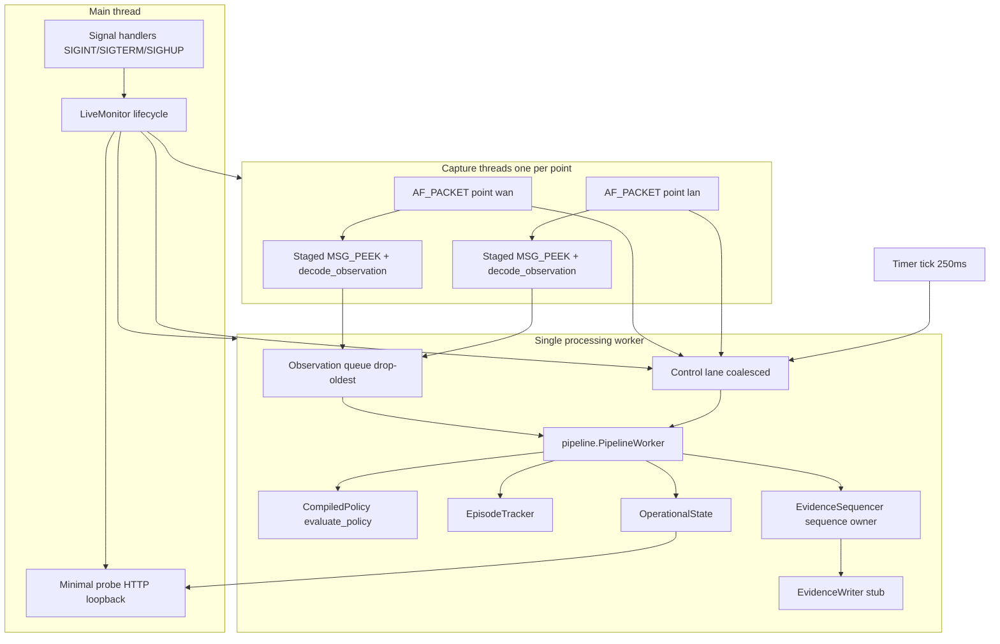
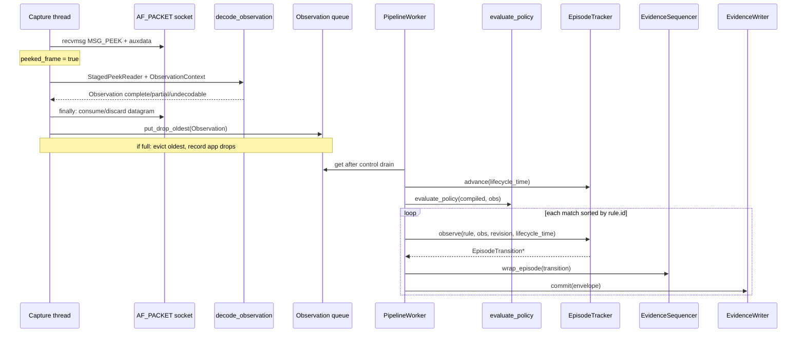
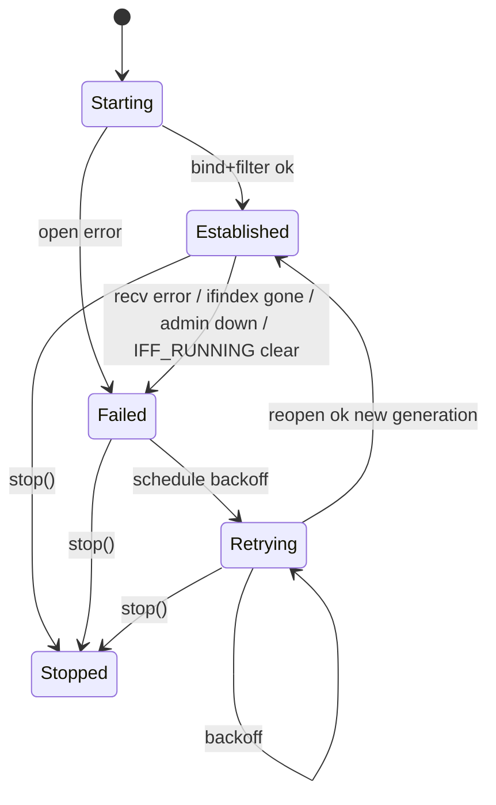

# ibn-monitor Phase 2: Raw Live Pipeline Design

| Field | Value |
|---|---|
| **Title** | Raw Live Pipeline (AF_PACKET capture, queues, ordered worker, operational state) |
| **Author** | TBD |
| **Date** | 2026-07-24 |
| **Status** | Approved |
| **Parent** | [v2 Architecture Design](./2026-07-23-ibn-monitor-v2-architecture-design.md) |
| **Delivery item** | Umbrella § Delivery decomposition item 2 |
| **Depends on** | Phase 1 (v2 core and replay) — committed on `init` |
| **Unblocks** | Phase 3 (evidence journal + notifications), Phase 4 (read model / HTTP) |
| **Revision** | 2026-07-24 r2 — addresses design review |

---

## Overview

Phase 1 delivered a pure, cross-platform v2 domain: explicit policy, compiled matching, bounded header decoding, classic-PCAP event-time replay, episode state machine, and schema-v2 evidence sequencing. Live `run` and `render-nftables` still use the v1 Scapy/`PacketMetadata` path.

Phase 2 replaces the live sensor path with the umbrella architecture’s raw capture and ordered pipeline: one `AF_PACKET`/`SOCK_RAW` thread per capture point, owned cBPF templates, staged `MSG_PEEK` decode via existing `decode.py`, a bounded drop-oldest observation queue plus a separate control lane, a single ordered processing worker (policy match → episodes → evidence commit), transactional SIGHUP policy reload, source recovery with generation IDs, an operational state machine (`starting` / `ready` / `degraded` / `stopping`), and graceful SIGTERM shutdown.

This phase **hard-cuts live `run` to version-2 config and AF_PACKET**. Offline analysis remains `replay` (already v2). `render-nftables` stays on the v1 path until Phase 5. Phase 3/4 surfaces (durable journal, webhook eligibility, atomic read model, full ops HTTP) receive only **minimal stubs** sufficient to exercise the pipeline — with a **minimal loopback probe** for operability during the hard-cut window.

---

## Background & Motivation

### Current state (after Phase 1)

| Path | Implementation |
|---|---|
| Live capture | `ScapyLiveSource` → `packet_to_metadata()` → `MonitorService.on_packet` (sync in callback) |
| Offline PCAP via `run` | `PcapReplaySource` (Scapy) + v1 events |
| Offline PCAP v2 | `ibn-monitor replay` → `replay.py` (no Scapy, event-time) |
| Policy live | v1 `PolicyEngine` + `Rule` / `action` |
| Policy v2 | `compile_policy` / `evaluate_policy` / `EpisodeTracker` / `EvidenceSequencer` |
| Readiness | Single boolean `Metrics.ready` |

### Pain points addressed by Phase 2

1. **Capture callback work** — v1 evaluates policy and writes JSONL inside the Scapy callback. Under load this couples capture latency to disk/webhook and cannot report application drops honestly.
2. **No multi-point / topology model** — v1 has one optional `sensor.interface` and free-form BPF; v2 config already defines named capture points, direction, and promiscuous intent that live never consumed.
3. **No degradation contract** — quiet traffic, interface loss, and queue overflow are invisible; readiness is a single boolean.
4. **Scapy as production capture** — heavier, less controllable timestamps/auxdata/statistics, free-form BPF, and hard to capability-harden. The umbrella selects direct AF_PACKET.
5. **Dual event schemas on live** — operators running live still get schema-v1 per-packet events while replay produces schema-v2 episodes.

### Phase 1 interfaces Phase 2 must consume without renaming

These names and call shapes are frozen for Phase 2 consumers:

| Symbol | Module | Role |
|---|---|---|
| `Observation` | `models.py` | Frozen L3/L4 metadata record |
| `PolicyV2Config` | `config.py` | Loaded/validated v2 config + revisions |
| `CompiledPolicy` | `policy.py` | Immutable IR (`revision`, `predicates`) |
| `compile_policy` / `evaluate_policy` | `policy.py` | Build IR; all-match evaluation |
| `EpisodeTracker` | `episodes.py` | `observe`, `advance`, `close_all`, `snapshot` |
| `EpisodeSettings` | `episodes.py` | capacity / idle / progress |
| `EvidenceSequencer` | `events.py` | `wrap_episode` → `EvidenceEnvelope` |
| `serialize_evidence` | `events.py` | Size-bounded JSONL line |
| `HeaderReader` / `ObservationContext` / `decode_observation` | `decode.py` | Bounded header decode |
| `CapturePointConfig` / `ProcessingV2Config` | `config.py` | Capture points + queue/drain knobs |
| `canonical_policy_revision` / `canonical_config_revision` | `config.py` | SHA-256 of rule wire / full config wire |

Note: the umbrella names `advance_live` / `advance_watermark`; Phase 1 shipped a single `EpisodeTracker.advance(now)`. Live uses monotonic seconds; replay uses event-time seconds. Phase 2 **must not rename** `advance`.

---

## Goals & Non-Goals

### Goals

1. Deliver a Linux-only live pipeline that turns capture-point traffic into sequenced schema-v2 episode evidence under the umbrella performance gate (10k obs/s, 100 rules, p99 episode-start < 1 s, no steady-state application drops).
2. Introduce `ObservationSource` as the live capture seam; implement AF_PACKET with owned cBPF, `MSG_PEEK` staged decode, nanosecond timestamps, VLAN auxdata, `PACKET_STATISTICS`, and promiscuous membership.
3. Isolate traffic (bounded drop-oldest queue) from lifecycle/control (small coalescing control lane).
4. Own process operational state with concurrent reason codes and readiness semantics matching the umbrella.
5. Transactional **policy-only** SIGHUP reload that rejects any restart-only setting change and closes episodes under the old revision when `policy_revision` changes.
6. Recover capture points across interface down/recreate with new source-generation IDs; any failed required point degrades aggregate readiness.
7. Graceful SIGTERM/SIGINT shutdown ordering per umbrella.
8. Wire `ibn-monitor run` to **version 2 only** for live operation.
9. Unit-test the pipeline without privileges; outline privileged Linux ns/veth integration tests.
10. Document Phase 3/4 seams clearly so journal/HTTP work does not re-open pipeline ownership.
11. Keep live **operable** after the hard cut via a minimal loopback probe (`/healthz`, `/readyz`).

### Non-Goals (explicit)

| Item | Owner |
|---|---|
| Durable journal rotation, fsync schedule, emergency buffer | Phase 3 |
| Webhook eligibility, retries, Idempotency-Key, shutdown drain | Phase 3 |
| Atomic read model, split probe/ops HTTP listeners, full dashboard v2 | Phase 4 (Phase 2 ships **probe-only** stub) |
| Topology-aware nftables renderer, hardened deploy | Phase 5 |
| Full performance lab / release qualification | Phase 6 |
| TPACKET_V3 / AF_XDP | Follow-on **only if** recvmsg fails the performance gate |
| PCAPNG, Wi-Fi monitor mode, payload capture | Out of product |
| Changing Phase 1 pure APIs or replay semantics | Freeze |

---

## Proposed Design

### Architecture



### Thread ownership

| Thread | Owns | Must not |
|---|---|---|
| **Main** | Signal install, `LiveMonitor.start/stop`, process exit code, probe server lifecycle | Decode packets, mutate episodes |
| **Capture × N** | Socket FD, recvmsg/peek/consume loop, local decode, enqueue Observation, enqueue lifecycle + stats control msgs | Write journal, touch EpisodeTracker, compile policy, block on full control lane |
| **Processing worker × 1** | Observation order, control messages, `CompiledPolicy` snapshot, `EpisodeTracker`, **sequence allocation** (`EvidenceSequencer`), evidence commit, operational state transitions, timer-driven `advance` | Own sockets, block long on network I/O |
| **Probe HTTP** | Read-only `OperationalSnapshot` | Mutate pipeline state; expose ops dashboard |

Webhook worker is **not** started in Phase 2 (Phase 3).

### Module map (Phase 2 delta)

Phase 2 **refines the umbrella file split for testability**; behavioral contracts are unchanged. Matching remains in `policy.py` (`evaluate_policy`) as Phase 1 shipped — do not “restore” evaluation into `engine.py`. cBPF, Linux socket helpers, staged reader, ops state, and evidence stub are separate modules so pure tests do not import platform sockets.

| Path | Responsibility |
|---|---|
| `src/ibn_monitor/models.py` | Operational state, reason codes, source status, control messages, system evidence payload union. |
| `src/ibn_monitor/capture.py` | `ObservationSource` protocol, `MemoryObservationSource`, later `AfPacketSource`; platform guards. Remove Scapy adapters after CLI cut. |
| `src/ibn_monitor/cbpf.py` | **New.** Owned classic-BPF templates using `SKF_AD_PKTTYPE`. Pure construct; no socket I/O. |
| `src/ibn_monitor/linux_packet.py` | **New.** Linux-only constants, auxdata, statistics, ifindex/flags, promiscuous membership. |
| `src/ibn_monitor/staged_reader.py` | **New.** `StagedPeekReader` implementing `HeaderReader` with MSG_PEEK + mandatory consume. |
| `src/ibn_monitor/pipeline.py` | **New.** Queues, control lane, `PipelineWorker`, timer, SIGHUP reload, shutdown drain, shared `process_observation`. |
| `src/ibn_monitor/ops_state.py` | **New.** Operational state machine + reason set; immutable snapshot export. |
| `src/ibn_monitor/evidence_stub.py` | **New.** `EvidenceWriter` protocol + Memory/File writers (no rotation/fsync/emergency). |
| `src/ibn_monitor/probe.py` | **New.** Minimal loopback `/healthz` + `/readyz` over `OperationalSnapshot`. |
| `src/ibn_monitor/monitor.py` | `LiveMonitor` composes sources + pipeline + probe; delete v1 `MonitorService` when live path is cut. |
| `src/ibn_monitor/cli.py` | `run` requires version 2; reject `--pcap`; Linux check; signals → control; exit codes. |
| `src/ibn_monitor/events.py` | `wrap_system(...)`; keep `wrap_episode` unchanged; sequence ownership stays here through Phase 3. |
| `src/ibn_monitor/replay.py` | Prefer calling shared `process_observation` (parity with live). |
| `tests/…` | Pure unit tests + optional `tests/integration_linux/`. |

`decode.py`, `policy.py`, `episodes.py`, `config.py` loaders remain the evaluation core. Capture never imports policy.

### Data flow (per observation)



**Lifecycle time rule (normative):**  
`lifecycle_time = observation.monotonic_at if observation.monotonic_at is not None else worker_monotonic_now()`.  
Capture **must** set `monotonic_at` on every live observation. Shared helper (see §5) uses the same order as `replay.py` `_process_observation`: `advance` → `evaluate_policy` → sorted matches → `observe` → commit. On existing episode keys, `observe` returns `()` (progress only via `advance`) — do not “fix” this.

---

## Public Interfaces

### 1. `ObservationSource` protocol

Replaces `PacketSource` for the v2 live path. Located in `capture.py`. Landed early (PR3) with `MemoryObservationSource` before AF_PACKET.

```python
# capture.py
from collections.abc import Callable
from typing import Protocol

from .models import Observation, ControlMessage, SourceStatsSnapshot

ObservationSink = Callable[[Observation], None]
ControlSink = Callable[[ControlMessage], None]


class ObservationSource(Protocol):
    """One logical capture point (or test double)."""

    @property
    def capture_point(self) -> str:
        """Stable configured name (e.g. wan)."""
        ...

    def start(
        self,
        observation_sink: ObservationSink,
        control_sink: ControlSink,
    ) -> None:
        """Start the capture thread.

        Returns after the first establish attempt completes (success or
        failure reported on the control lane). Does not wait for traffic.
        Subsequent packets and lifecycle events arrive asynchronously.
        """
        ...

    def stop(self) -> None:
        """Stop capture and close the socket. Idempotent. Joins thread."""
        ...
```

**Stats ownership (normative):** Capture threads **self-poll** `PACKET_STATISTICS` on their own interval (`stats_poll_interval_seconds`, default 1.0 s) and emit `source_stats` control messages. There is **no** `request_stats()` on the protocol and the worker does **not** pull stats from sources. This avoids dual-poll double-read of the resetting kernel counter.

**Contract differences vs v1 `PacketSource`:**

| | v1 `PacketSource` | v2 `ObservationSource` |
|---|---|---|
| Payload | `PacketMetadata \| None` | Always `Observation` (including `outcome=undecodable`) |
| Callback site | May do heavy work | Must only enqueue (non-blocking) |
| Multi-point | One interface | One source instance per capture point |
| Lifecycle events | Optional `on_established` | Control messages (`source_established`, `source_failed`, …) |
| Finite PCAP | `PcapReplaySource.start` blocks to EOF | Not this protocol — use `replay` CLI |

### 2. `MemoryObservationSource` (tests)

```python
class MemoryObservationSource:
    def __init__(self, capture_point: str) -> None: ...

    @property
    def capture_point(self) -> str: ...

    def start(self, observation_sink, control_sink) -> None:
        """Records sinks; optionally emits source_established immediately."""
        ...

    def stop(self) -> None: ...

    def push(self, observation: Observation) -> None:
        """Test helper: deliver one observation through the sink."""
        ...

    def emit_failed(self, reason: str) -> None: ...
    def emit_stats(self, stats: SourceStatsSnapshot) -> None: ...
    def emit_established(self, source_generation: str) -> None: ...
```

### 3. Control messages

Frozen dataclasses in `models.py`.

```python
from typing import Literal
from dataclasses import dataclass

ControlKind = Literal[
    "timer",
    "shutdown",
    "force_shutdown",
    "reload_request",
    "source_established",
    "source_failed",
    "source_retrying",
    "source_recovered",
    "source_stopped",
    "source_stats",
    "observation_dropped",
]

@dataclass(frozen=True, slots=True)
class ControlMessage:
    kind: ControlKind
    monotonic_at: float
    capture_point: str | None = None
    source_generation: str | None = None
    reason_code: str | None = None
    stats: "SourceStatsSnapshot | None" = None
    detail: str | None = None
    drops: int = 0  # for observation_dropped
```

#### Control-lane capacity and non-blocking sink

- Capacity: **256** messages.
- Observation queue capacity: `ProcessingV2Config.observation_queue_capacity` (default **10_000**).

**Coalescing rules:**

| Kind | Coalesce policy |
|---|---|
| `timer` | Keep latest only |
| `source_stats` | Per `capture_point`: keep latest |
| `shutdown` / `force_shutdown` | Sticky; never drop; `force_shutdown` supersedes `shutdown` |
| `reload_request` | Coalesce to one pending reload |
| Source lifecycle | Per `capture_point`: keep **latest** state transition only (established/failed/retrying/recovered/stopped); never block |
| `observation_dropped` | Per `capture_point`: sum `drops` into pending message |

**Non-blocking `control_sink` (normative):** Capture threads and the main signal path must never block on the control lane.

1. Apply coalescing first (may free slots without growing the queue).
2. If still full, drop the oldest **droppable** message (`timer`, `source_stats`, merged `observation_dropped`).
3. If still full (lane saturated with sticky shutdown + distinct lifecycle endpoints under extreme flap), **replace** the oldest lifecycle message for the **same** `capture_point` with the new one; if no same-point slot exists, drop the new lifecycle message, increment `control_lane_drops_total{kind=…}`, and rely on the next self-poll/stats/timer path to re-derive source health from the last applied state plus a forced re-emit on the capture thread after a short sleep.
4. Shutdown/force are inserted by **replacing any droppable** or by overwriting a reserved high-priority slot (implementation: two sticky flags outside the deque plus the deque for the rest).

Metric: `ibn_monitor_control_lane_drops_total` labeled by `kind` (bounded enum).

### 4. Observation queue

```python
class ObservationQueue:
    def __init__(self, capacity: int) -> None: ...

    def put_drop_oldest(self, item: Observation) -> int:
        """Non-blocking. Returns number of evicted items (0 or ≥1)."""
        ...

    def get(self, timeout: float | None) -> Observation | None: ...

    def qsize(self) -> int: ...

    def drain(self, max_items: int | None = None) -> list[Observation]: ...
```

When `put_drop_oldest` returns `> 0`:

1. Capture records local drop counts and enqueues/folds `observation_dropped` on the control lane.
2. Worker sets reason `app_queue_drops` immediately → `degraded`.
3. Recovery: utilization &lt; 50% of capacity for `queue_recovery_cooldown_seconds` (default 30 s) **and** no new app drops in that window → clear reason; emit system event `coverage_gap` summarizing interval (see §9).

### 5. Pipeline worker and shared observation processing

```python
@dataclass(frozen=True, slots=True)
class PipelineConfig:
    observation_capacity: int
    queue_recovery_cooldown_seconds: float
    graceful_drain_seconds: float
    timer_interval_seconds: float = 0.25
    config_path: str


class PipelineWorker:
    def __init__(
        self,
        config: PolicyV2Config,
        *,
        pipeline_config: PipelineConfig,
        evidence: EvidenceWriter,
        boot_id: str,
        clock: Clock | None = None,
    ) -> None: ...

    def observation_sink(self, observation: Observation) -> None: ...
    def control_sink(self, message: ControlMessage) -> None: ...
    def start(self) -> None: ...
    def stop(self, *, force: bool = False) -> None: ...
    def snapshot(self) -> OperationalSnapshot: ...
```

**Worker loop priority:**

1. Drain all pending control messages (after coalescing).
2. Process up to `BATCH` observations (64) or until queue empty.
3. If idle, wait on a condition with timeout ≤ timer interval.

**On `timer`:**

- `tracker.advance(monotonic_now)` → commit progress/idle closes.
- Evaluate app-queue and kernel-drop recovery cooldowns (§9).
- Re-evaluate operational reasons (source health from last lifecycle, drops, policy present).
- Publish new `OperationalSnapshot` for the probe.
- **Does not** call into capture sources for stats (self-poll only).

#### Shared `process_observation` (live + replay parity)

Extract a pure helper used by `replay.py` and `PipelineWorker`:

```python
# pipeline.py (or a small process.py if preferred — default: pipeline.py)
def process_observation(
    observation: Observation,
    *,
    lifecycle_time: float,
    policy: CompiledPolicy,
    tracker: EpisodeTracker,
) -> tuple[EpisodeTransition, ...]:
    """Exact order matches Phase 1 replay._process_observation.

    1. tracker.advance(lifecycle_time)
    2. matches = evaluate_policy(policy, observation)
    3. for match in sorted(matches, key=lambda m: m.rule.id):
           tracker.observe(...)
    Returns all transitions in emission order (advance first, then observes).
    """
```

Live worker after `process_observation`:

```text
for t in transitions:
    evidence.commit(sequencer.wrap_episode(t, emitted_at=wall_now))
# update counters: observations by outcome, matches, phases
```

Parity test: feed the same `Observation` sequence through replay path and live worker (memory source); episode envelopes (excluding `boot_id`/`sequence`/`emitted_at`) match.

### 6. `LiveMonitor` public API

```python
# monitor.py
class LiveMonitor:
    def __init__(
        self,
        config: PolicyV2Config,
        *,
        config_path: str,
        sources: tuple[ObservationSource, ...] | None = None,
        evidence: EvidenceWriter | None = None,
        boot_id: str | None = None,
        probe_enabled: bool | None = None,
    ) -> None:
        """If sources is None, build one AfPacketSource per capture point.
        boot_id defaults to str(uuid.uuid4()).
        evidence defaults to FileEvidenceWriter(config.journal.file).
        probe_enabled defaults to config.http.probe.enabled.
        """
        ...

    @property
    def boot_id(self) -> str: ...

    @property
    def sources(self) -> tuple[ObservationSource, ...]: ...

    def start(self) -> None:
        """Non-blocking after sources' first establish attempt.

        Order:
          1. evidence ready; sequencer constructed with sensor_id + boot_id
          2. worker.start()  # queue sinks live
          3. commit system sensor_start
          4. for each source: source.start(worker.observation_sink, worker.control_sink)
          5. start probe HTTP if enabled
        Aggregate readiness becomes ready only when all points established
        (via control messages) — start() does not wait for ready.
        """
        ...

    def stop(self, *, force: bool = False) -> None:
        """Order matches §11: stopping → stop sources → drain → close episodes
        → flush evidence → stop probe → join worker.
        """
        ...

    def request_reload(self) -> None:
        """Enqueue reload_request (from SIGHUP)."""
        ...

    def request_shutdown(self, *, force: bool = False) -> None:
        """Enqueue shutdown or force_shutdown."""
        ...

    def snapshot(self) -> OperationalSnapshot:
        return self._worker.snapshot()
```

**Source registry:** `LiveMonitor` holds `self._sources: tuple[ObservationSource, ...]` for start/stop only. Stats and health flow exclusively through the control lane; the worker never iterates sources for `request_stats`.

**Boot / generation formatting:**

- `boot_id = str(uuid.uuid4())` unless injected (tests).
- `source_generation = f"{capture_point}:{boot_id}:{generation_counter}"` with `generation_counter` starting at 1 per point, incrementing on every successful reopen.

**CLI start behavior:**

- `start()` returns after all sources have completed their first establish attempt (each `source.start` returns).
- Main thread then waits on `stop_event`.
- If after **`startup_ready_timeout_seconds`** (default **30**, fixed constant in Phase 2 — not a config schema field unless already present; do not add schema churn) the state is still not `ready` **and** at least one point never established, log structured failure and **continue running degraded** (supervisor can watch `/readyz`). Do **not** exit solely for slow interfaces — cable/ifup races are recovery's job. Exit non-zero only on: config error, non-Linux, permission denied opening any socket when **all** points fail immediately with `EPERM`/`EACCES`, or uncaught worker death (`REASON_WORKER_DEAD` → probe `/healthz` 500).

### 7. AF_PACKET source

```python
@dataclass(frozen=True, slots=True)
class AfPacketSourceConfig:
    sensor_id: str
    capture_point: CapturePointConfig
    boot_id: str
    rcvbuf_bytes: int = 2 * 1024 * 1024
    header_budget: int = 512  # MAX_HEADER_BYTES
    stats_poll_interval_seconds: float = 1.0
    reopen_backoff_initial_seconds: float = 1.0
    reopen_backoff_max_seconds: float = 30.0
    interface_check_interval_seconds: float = 1.0


class AfPacketSource:
    """Linux-only ObservationSource for one capture point."""

    def __init__(self, config: AfPacketSourceConfig) -> None:
        if sys.platform != "linux":
            raise RuntimeError("AfPacketSource requires Linux")
        ...
```

#### Startup sequence

1. Resolve interface name → ifindex. Fail → `source_failed`.
2. Validate link type is Ethernet (`ARPHRD_ETHER`). Reject others.
3. `socket(AF_PACKET, SOCK_RAW, htons(ETH_P_ALL))`.
4. Bind to ifindex.
5. If `promiscuous`: `PACKET_ADD_MEMBERSHIP` / `PACKET_MR_PROMISC`.
6. Enable nanosecond timestamps (`SO_TIMESTAMPNS` / `SCM_TIMESTAMPNS`).
7. Enable `PACKET_AUXDATA` (VLAN TCI + `tp_len`).
8. `setsockopt(SO_RCVBUF, rcvbuf)` — accept kernel clamp; log effective size.
9. Attach cBPF from `cbpf.build_filter(direction=..., snap_len=header_budget)`; `SO_LOCK_FILTER=1` when available.
10. Verify `PACKET_STATISTICS` once.
11. Allocate new `source_generation`; emit `source_established` **before** any observation for that generation.
12. Enter recv loop.

#### Recv / decode loop — **always consume after peek**

```text
loop until stop:
  peeked = False
  try:
    reader = StagedPeekReader(sock, max_header=512)
    # constructor or first prefix() performs MSG_PEEK; sets peeked=True
    # when a datagram is observed
    if not reader.has_datagram:
      continue  # timeout / EAGAIN; nothing to consume
    peeked = True
    direction = map_packet_type(reader.packet_type)
    ctx = ObservationContext(
        captured_at=reader.captured_at or wall_fallback,
        monotonic_at=time.monotonic(),
        sensor_id=...,
        source_generation=current_gen,
        capture_point=name,
        interface=ifname,
        direction=direction,
    )
    try:
      obs = decode_observation(reader, DLT_EN10MB, ctx)
    except Exception:
      # Must not terminate source; synthesize undecodable observation
      obs = undecodable_observation(ctx, reason="decode_exception")
    observation_sink(obs)
  except temporary socket errors (EAGAIN, EINTR, timeout):
    continue
  except fatal (ENODEV, ENETDOWN, EBADF, …) / interface invalid:
    if peeked: discard_datagram_best_effort()
    emit source_failed; enter recovery; continue
  finally:
    if peeked:
      reader.consume()  # ALWAYS discard current datagram after successful peek
```

**Normative consume rules:**

1. Once a datagram has been observed via `MSG_PEEK`, the socket **must** advance before the next peek (consume header span or full-datagram discard).
2. `consume_length == 0` is legal **only** if peek itself failed before any datagram was observed.
3. On AF_PACKET, a non-PEEK `recv` of any positive length discards the remainder of that datagram — header-only consume is correct.
4. Unit tests with a fake socket assert **exactly one consume per successful peek**, including undecodable and exception paths.

#### Direction mapping (userspace)

| `sll_pkttype` / constant | Value | ObservedDirection |
|---|---:|---|
| `PACKET_HOST` | 0 | `inbound` |
| `PACKET_BROADCAST` | 1 | `inbound` |
| `PACKET_MULTICAST` | 2 | `inbound` |
| `PACKET_OTHERHOST` | 3 | `inbound` |
| `PACKET_OUTGOING` | 4 | `outbound` |

cBPF also filters by configured direction so unwanted directions never reach user space.

#### `StagedPeekReader`

```python
class StagedPeekReader:
    """HeaderReader backed by MSG_PEEK; never exposes payload beyond span."""

    wire_length: int
    packet_type: int
    has_datagram: bool
    captured_at: datetime | None

    def prefix(self, length: int) -> bytes: ...

    @property
    def consume_length(self) -> int:
        """Bytes to recv without MSG_PEEK after decode (≤ max_header).
        Minimum 1 if has_datagram so the kernel drops the rest of the frame.
        """
        ...

    def consume(self) -> None:
        """Non-PEEK recv of consume_length; discard. Idempotent after first call."""
        ...
```

#### PACKET_STATISTICS (single owner)

- Only the **capture thread** for that socket calls `getsockopt(PACKET_STATISTICS)`.
- Kernel counters reset on read; thread accumulates monotonic `kernel_packets` / `kernel_drops`.
- Emits `source_stats` every `stats_poll_interval_seconds` and on transition to failed/stopped.

```python
@dataclass(frozen=True, slots=True)
class SourceStatsSnapshot:
    capture_point: str
    source_generation: str
    kernel_packets: int
    kernel_drops: int
    app_enqueue_ok: int
    app_enqueue_drops: int
    decode_complete: int
    decode_partial: int
    decode_undecodable: int
```

### 8. Owned cBPF templates (`cbpf.py`)

No free-form BPF in v2 live path.

```python
def build_filter(
    *,
    direction: CaptureDirection,  # inbound | outbound | both
    snap_len: int = 512,
) -> list[tuple[int, int, int, int]]:
    """Return classic BPF instructions as (code, jt, jf, k) tuples.

    Algorithm (normative):
      1. Load packet type: ldb [SKF_AD_OFF + SKF_AD_PKTTYPE]
         SKF_AD_OFF = -0x1000; SKF_AD_PKTTYPE = 4
      2. Direction gate:
         - inbound: accept pkttype in {0,1,2,3}; reject 4 (OUTGOING)
         - outbound: accept pkttype == 4 only
         - both: skip reject on type
      3. Parse EtherType at offset 12; loop up to 2 VLAN tags
         (0x8100, 0x88A8, 0x9100): accept tag, advance 4, reload type
      4. Accept only 0x0800 (IPv4) or 0x86DD (IPv6); else ret 0
      5. ret snap_len  (absolute snapshot; userspace never sees full frame)
    """
```

Constants for tests:

| Name | Value |
|---|---:|
| `PACKET_HOST` | 0 |
| `PACKET_BROADCAST` | 1 |
| `PACKET_MULTICAST` | 2 |
| `PACKET_OTHERHOST` | 3 |
| `PACKET_OUTGOING` | 4 |
| `SKF_AD_OFF` | `-0x1000` |
| `SKF_AD_PKTTYPE` | `4` |
| VLAN TPIDs | `0x8100`, `0x88A8`, `0x9100` |
| IPv4 / IPv6 ethertypes | `0x0800`, `0x86DD` |

Tests: semantic instruction-list equality (or a tiny BPF interpreter over synthetic metadata), **not** only opaque hex blobs. Property: never accepts non-IP ethertypes; snap ≤ 512.

Attachment: `SO_ATTACH_FILTER` + `SO_LOCK_FILTER` when available.

### 9. Source recovery



**Carrier / running policy (normative):** On each `interface_check_interval_seconds`, read interface flags. Treat as failure (end generation, emit `source_failed`, enter retry) when any of:

- interface name missing / ifindex changed without clean reopen,
- `IFF_UP` clear (administratively down),
- `IFF_RUNNING` clear for a full check interval (includes no-carrier and similar).

Traffic silence with `IFF_UP|IFF_RUNNING` set is **not** failure.

Backoff: exponential 1 s → 30 s, reset on successful establish.

On reopen success: new `source_generation`; emit `source_recovered` then treat as established (or single `source_recovered` carrying the new generation — implementers emit **`source_recovered`** with `source_generation` set; ops maps that to established).

Aggregate readiness: any configured point not Established ⇒ reason `capture_point_unavailable`.

### 10. Operational state machine (`ops_state.py`)

```python
OperationalStateName = Literal["starting", "ready", "degraded", "stopping"]

REASON_CAPTURE_POINT_UNAVAILABLE = "capture_point_unavailable"
REASON_KERNEL_DROPS = "kernel_drops"
REASON_APP_QUEUE_DROPS = "app_queue_drops"
REASON_WORKER_DEAD = "worker_dead"
REASON_JOURNAL_UNAVAILABLE = "journal_unavailable"  # Phase 2 healthy stub never sets
REASON_NO_POLICY = "no_policy"
REASON_SHUTDOWN = "shutdown"
```

```python
@dataclass(frozen=True, slots=True)
class OperationalSnapshot:
    state: OperationalStateName
    reasons: frozenset[str]
    ready: bool  # True iff state == "ready"
    policy_revision: str | None
    config_revision: str | None
    sources: tuple[SourceStatus, ...]
    queue_depth: int
    queue_capacity: int
    app_queue_drops_total: int
    kernel_drops_total: int
    boot_id: str
    sensor_id: str


@dataclass(frozen=True, slots=True)
class SourceStatus:
    capture_point: str
    interface: str
    state: Literal["starting", "established", "failed", "retrying", "stopped"]
    source_generation: str | None
    last_error: str | None
    kernel_packets: int
    kernel_drops: int
```

**Transitions:**

| From | To | Trigger |
|---|---|---|
| (init) | `starting` | Worker start |
| `starting` | `ready` | All points established, policy loaded, no drop reasons |
| `starting` | `degraded` | Required point failed or drops during startup |
| `ready` | `degraded` | Any core reason set |
| `degraded` | `ready` | All core reasons cleared |
| any | `stopping` | Shutdown control |

**Readiness:** `ready == (state == "ready")`. Quiet traffic does not degrade. Webhook failure (future) does not degrade.

#### App-queue drop degrade/clear

| Event | Action |
|---|---|
| Any app queue eviction | Set `app_queue_drops` immediately; state ≥ degraded |
| Clear | Queue depth &lt; 50% capacity for `queue_recovery_cooldown_seconds` **and** zero new app drops in window |
| Evidence | On clear (or on entering degraded if not yet emitted for this incident): `coverage_gap` with fields below |

#### Kernel-drop degrade/clear (normative)

Mirrors app-queue recovery for the umbrella zero-drop steady-state contract:

| Event | Action |
|---|---|
| `source_stats` shows `kernel_drops` **increased** vs last applied snapshot for that point | Add delta to `kernel_drops_total`; set reason `kernel_drops`; state ≥ degraded; record incident start if new |
| Clear | No further kernel-drop **increases** from any point for `queue_recovery_cooldown_seconds` (reuse processing cooldown; same operator dial) |
| Evidence | On set (throttled: once per incident): `kernel_drops_observed`. On clear: `coverage_gap` may include kernel totals for the incident window, or emit `kernel_drops_recovered` — **use `coverage_gap`** with `cause=kernel_drops` to limit event types |

**`coverage_gap` fields (system payload):**

```text
capture_point: str | null     # null if multi-point aggregate
source_generation: str | null
cause: "app_queue_drops" | "kernel_drops" | "mixed"
drops: int                    # delta over interval
interval_start: iso8601
interval_end: iso8601
```

**`kernel_drops_observed` fields:**

```text
capture_point: str
source_generation: str
delta: int
total: int
```

Zero-drop steady state means: after recovery cooldowns complete, neither reason is set and no further increases occur under the reference load. Transient startup spikes may degrade briefly; that is correct.

### 11. SIGHUP policy reload and exhaustive `RuntimeIdentity`

Main thread must not load config inside the signal handler:

```python
def _on_sighup(signum, frame):
    monitor.request_reload()
```

#### What may change on reload (allow-list)

**Only** fields that feed `canonical_policy_revision` / `_rule_wire`:

- `rules[*].id`, `description`, `enabled`, `match.*`, `severity`, `enforcement`
- Rule set membership (add/remove rules)

Description-only edits **do** change `policy_revision` today (`_rule_wire` includes description) → close episodes with `policy_reload` (not noop).

#### Restart-only: exhaustive `RuntimeIdentity`

`RuntimeIdentity` is **every effective field outside the policy-revision wire**. Normative definition:

```python
@dataclass(frozen=True, slots=True)
class RuntimeIdentity:
    """Hash-equivalent to full config minus rules.

    Construct via runtime_identity_from_config(config) which serializes the
    same shapes as config._config_wire but with rules omitted (or replaced
    by a fixed placeholder). Reload compares identity equality, not partial
    field lists in call sites.
    """
    version: int
    sensor: SensorV2Config                 # id, topology, capture_points (name, interface, direction, promiscuous)
    processing: ProcessingV2Config         # observation_queue_capacity, queue_recovery_cooldown_seconds, graceful_drain_seconds
    episodes: EpisodeV2Config              # capacity, idle_seconds, progress_seconds, replay_lateness_seconds
    journal: JournalV2Config               # file, max_bytes, backup_count, fsync_interval_seconds, emergency_*
    http: HttpV2Config                     # probe + operations listeners
    notifications: NotificationV2Config   # webhook_url_env, timeouts, severity, attempts, drain, insecure flag
```

**Implementation preference (single source of truth):**

```python
def runtime_identity_hash(config: PolicyV2Config) -> str:
    wire = _config_wire(config)
    wire = {**wire, "rules": []}  # strip rules; policy_revision compared separately
    return _sha256(wire)
```

Alternatively compare field-by-field frozen `RuntimeIdentity`. Do **not** hand-maintain a partial allow-list in the worker.

#### Reload algorithm

```text
1. load_v2_config(config_path)
2. If runtime_identity_hash(new) != runtime_identity_hash(old):
     - emit policy_reload_failed (code=restart_required, detail=which section differs if cheap)
     - keep CompiledPolicy + EpisodeTracker + EpisodeSettings unchanged
     - readiness unchanged unless already unhealthy
     - return
3. compile_policy(new.rules, new.policy_revision)
4. If new.policy_revision == old.policy_revision:
     - emit policy_reload_noop
     - leave episodes untouched
     - still refresh config.rules reference if needed (identical revision ⇒ identical rules wire)
     - return
5. close_all(reason="policy_reload", lifecycle_time=mono) → commit closes
6. emit policy_reload_success {old_revision, new_revision}
7. Atomically replace self._policy and self._config (rules + policy_revision + config_revision)
   EpisodeSettings and EpisodeTracker instance remain (settings restart-only; already gated)
```

**Required unit tests:**

- `episodes.idle_seconds` change → `restart_required`; tracker still uses old idle.
- Rule match change → success; episodes closed with `policy_reload`.
- Description-only change → success path (revision changes); closes episodes.
- Enabled flip / severity / enforcement → revision change → close.
- Identical file → noop.

### 12. Graceful SIGINT/SIGTERM shutdown

**SIGINT ≡ SIGTERM** (both request graceful shutdown). Second signal of either type → force.

```text
1. control: shutdown → state=stopping, reason=shutdown; ready=false
2. LiveMonitor: stop all sources (source_stopped, close generations)
3. Worker drains observation queue up to graceful_drain_seconds (default 10)
4. close_all(reason="shutdown") → commit
5. evidence.flush()
6. (Phase 3: webhook drain — no-op)
7. stop probe; stop timer; join worker
8. exit 0
```

**Force path (second signal):** enqueue `force_shutdown`; skip drain; best-effort `close_all`; flush best-effort; exit **143** (128+15 SIGTERM) regardless of which signal forced. If only SIGINT was used twice, still exit **130** (128+2) when the forcing signal was SIGINT — record `forcing_signum` on the control message.

| Exit code | Meaning |
|---:|---|
| 0 | Clean stop |
| 2 | Config / usage / version / `--pcap` rejected |
| 3 | Permission denied (`CAP_NET_RAW` / EPERM) |
| 4 | Platform / OS error (non-Linux live, fatal socket) |
| 130 | Forced by SIGINT |
| 143 | Forced by SIGTERM |
| 1 | Unexpected internal failure / worker dead at exit |

### 13. Evidence seam (Phase 2 stub) and sequence ownership

#### Decision: Option A — worker-owned sequencer (Phase 1 continuity)

**Sequence allocation remains in `EvidenceSequencer` on the processing worker** through Phase 2 and Phase 3.

- Umbrella module map text (“journal allocates sequence”) is refined: **journal durability/rotation/fsync/emergency** live in `journal.py`; **monotonic sequence + boot identity** stay with the worker-owned sequencer that Phase 1 already shipped.
- Phase 3 replaces `FileEvidenceWriter` with durable `JournalWriter` implementing the same `EvidenceWriter.commit(envelope) -> None` without re-assigning sequence numbers.
- If a future design ever moves allocation into the journal, that is a **new** major seam and requires a separate design; Phase 2–3 must not imply envelopes arrive unsequenced.

```python
class EvidenceWriter(Protocol):
    def commit(self, envelope: EvidenceEnvelope) -> None:
        """Append already-sequenced envelope in processing order."""
        ...

    def flush(self) -> None: ...


class FileEvidenceWriter:
    """Append-only JSONL at config.journal.file; no rotation/fsync/emergency."""

    def __init__(self, path: Path) -> None: ...


class MemoryEvidenceWriter:
    def __init__(self) -> None:
        self.events: list[EvidenceEnvelope] = []
```

**Live always opens `PolicyV2Config.journal.file`** for the file stub (path relative to process cwd unless absolute). `LiveMonitor` constructs `FileEvidenceWriter(Path(config.journal.file))` by default.

#### System payloads

```python
SystemEventName = Literal[
    "sensor_start",
    "sensor_stopping",
    "sensor_stop",
    "source_established",
    "source_failed",
    "source_retrying",
    "source_recovered",
    "source_stopped",
    "policy_reload_success",
    "policy_reload_noop",
    "policy_reload_failed",
    "coverage_gap",
    "kernel_drops_observed",
]

@dataclass(frozen=True, slots=True)
class SystemPayload:
    name: SystemEventName
    fields: dict[str, object]  # bounded; see wrap_system validation
```

```python
# EvidenceEnvelope
payload: EpisodeTransition | SystemPayload

def to_dict(self) -> dict[str, object]:
    # Episode branch: existing shape — must remain byte-compatible for replay tests
    # System branch:
    # {
    #   "schema_version": 2,
    #   "event_id": "...",
    #   "event_type": "system." + payload.name,  # e.g. system.policy_reload_success
    #   "sensor_id", "boot_id", "sequence", "emitted_at",
    #   "policy_revision": <str|null>,
    #   "payload": {"name": <name>, ...fields}
    # }
```

```python
def wrap_system(
    self,
    name: SystemEventName,
    fields: dict[str, object],
    *,
    emitted_at: datetime,
    policy_revision: str | None,
) -> EvidenceEnvelope:
    """Validate:
    - name in SystemEventName
    - ≤ 32 field keys; keys match [A-Za-z][A-Za-z0-9_]*
    - values JSON-serializable (str, int, float, bool, null, short lists)
    - serialize_evidence size ≤ MAX_EVIDENCE_LINE_BYTES (262144)
    event_type = "system." + name
    policy_revision: required (non-null) for policy_reload_*; optional for source_*;
      sensor_* may be null before first policy load (use current revision when available)
    """
```

### 14. Minimal probe (Phase 2 operability)

**Decision:** Phase 2 ships a **minimal loopback probe**, not full ops HTTP/dashboard.

```python
# probe.py
class ProbeServer:
    """Binds config.http.probe (default 127.0.0.1:9108).
    GET /healthz → 200 if worker alive; 500 if REASON_WORKER_DEAD
    GET /readyz  → 200 iff snapshot.ready else 503
    No /metrics, /api/state, or dashboard in Phase 2.
    """
```

- Default bind remains loopback; honor `allow_non_loopback` only with existing config semantics (still no auth — Phase 4 risk model).
- Snapshot is published atomically by the worker (replace a `threading`/`atomic` reference).
- Structured stderr logs still emit on every state transition:

```text
logger.info("operational_state", extra={
  "ibn_state": state,
  "ibn_reasons": sorted(reasons),
  "ibn_ready": ready,
  "ibn_policy_revision": policy_revision,
})
```

Stable keys: `ibn_state`, `ibn_reasons`, `ibn_ready`, `ibn_policy_revision`, `ibn_boot_id`.

### 15. CLI / `run` wiring

```text
ibn-monitor run --config policy.v2.json \
  [--capture-point NAME=IFACE ...] \
  [--interface IFACE]
```

| Input | Result |
|---|---|
| `version: 1` | Exit 2; message to use `migrate-policy` |
| `version: 2` non-Linux | Exit 4; live requires Linux |
| `version: 2` Linux | `LiveMonitor` + AF_PACKET |
| `--pcap` | Exit 2; use `ibn-monitor replay` |
| `--capture-point NAME=IFACE` | Repeatable; overrides matching capture point's interface before source construction |
| `--interface IFACE` | Allowed **only** when config has exactly one capture point; else exit 2 with message to use `--capture-point` |
| Both flags | Apply `--capture-point` first; `--interface` only if single point and not already overridden |

Signal handling: SIGINT/SIGTERM → `request_shutdown`; second → `request_shutdown(force=True)`; SIGHUP → `request_reload`.

### 16. Fate of v1 Scapy path — hard cut for live

| Surface | Phase 2 action | Rationale |
|---|---|---|
| `ibn-monitor run` live | **v2 only**, AF_PACKET | Single schema and capture stack |
| `ibn-monitor run --pcap` | **Removed** | Superseded by `replay` |
| Scapy adapters | **Deleted** (PR8, after CLI wiring) | Dead code |
| `MonitorService` v1 | **Deleted** | Replaced by `LiveMonitor` |
| `PacketSource` | **Deleted** | Replaced by `ObservationSource` |
| `render-nftables` | **Keep v1** | Phase 5 |
| v1 models | **Keep** until Phase 5 | Shared `models.py` |
| Scapy runtime dependency | **Removed** in PR8 | No production import |
| Scapy test optional extra | **dev optional** for integration harness traffic gen only | See PR plan |

**Migration:**

```bash
ibn-monitor migrate-policy --config policy.json --output policy.v2.json \
  --sensor-id ... --topology ... --capture-point wan=eth0
ibn-monitor replay --config policy.v2.json --pcap traffic.pcap \
  --output events-v2.jsonl --summary-output -
ibn-monitor run --config policy.v2.json   # Linux + CAP_NET_RAW
```

---

## API / Interface Changes (summary)

| Area | Before (Phase 1) | After (Phase 2) |
|---|---|---|
| Live capture seam | `PacketSource` | `ObservationSource` |
| Live config | v1 `AppConfig` | `PolicyV2Config` required |
| Offline PCAP | `run --pcap` or `replay` | **`replay` only** |
| Process service | `MonitorService` | `LiveMonitor` + `PipelineWorker` |
| Evidence live | v1 `EventLog` | Sequencer + `EvidenceWriter` schema v2 |
| Readiness | `Metrics.ready: bool` | `OperationalSnapshot` + minimal `/readyz` |
| BPF | Free-form string | Owned cBPF (`SKF_AD_PKTTYPE`) |
| Reload | `engine.replace_rules` | RuntimeIdentity gate + IR swap |

---

## Data Model Changes

### New model types (all frozen)

- `ControlMessage`, `SourceStatsSnapshot`, `SourceStatus`
- `OperationalSnapshot`, reason constants
- `SystemPayload` + `SystemEventName`; `EvidenceEnvelope.payload` union
- `RuntimeIdentity` construction via config wire minus rules

### Unchanged

- `Observation`, `PolicyRule`, `EpisodeTransition`, `EpisodeKey`, `FieldPresence`, `CompiledPolicy`, `PolicyV2Config` field layout

### Packaging / platform

```python
# linux_packet.py
if sys.platform != "linux":
    raise ImportError("linux_packet is only available on Linux")
```

Tests skip AF_PACKET on non-Linux. Windows CI: pure pipeline/cBPF/ops/reload tests.

---

## Alternatives Considered

### A. Keep Scapy for live, add queues only

Rejected — contradicts umbrella AF_PACKET; weak stats/auxdata; free-form BPF.

### B. Dual-run v1 Scapy + v2 AF_PACKET

Rejected — two schemas/readiness models; Phase 1 plan already ends transitional live path in Phase 2.

### C. TPACKET_V3 from day one

Deferred — recvmsg first; gate-driven follow-on only.

### D. Libpcap/pcapy-ng

Rejected — direction and dependency costs; umbrella chose raw sockets.

### E. Capture enqueues raw bytes; worker decodes

Rejected — umbrella places staged decode in capture; avoids payload-ish buffers in the queue.

### F. Journal-owned sequence numbers in Phase 2

Rejected for Phase 2–3 — would break Phase 1 `EvidenceSequencer` continuity and force API churn. Documented as deliberate umbrella module-map refinement (Option A).

### G. No HTTP until Phase 4

Rejected for operability — multi-point recovery/degrade needs `/readyz` during hard-cut. Minimal probe is in scope; full ops API stays Phase 4.

---

## Security & Privacy Considerations

| Topic | Phase 2 control |
|---|---|
| Capabilities | `CAP_NET_RAW` only; promiscuous via `PACKET_MR_PROMISC` |
| Payload | Header budget 512 B; always consume after peek; never log frames |
| BPF | Owned templates + lock; no operator bytecode |
| Policy reload | Full validation; exhaustive RuntimeIdentity; failed reload keeps IR |
| Probe | Loopback default; `/healthz`+`/readyz` only; no write routes |
| Evidence | L3/L4 metadata only |

---

## Observability

### Metrics (in-memory; Prometheus export Phase 4)

| Metric | Type | Labels |
|---|---|---|
| `observations_total` | counter | `capture_point`, `outcome` |
| `matches_total` | counter | `rule_id` |
| `episodes_started_total` / `progressed` / `closed` | counter | `close_reason` when closed |
| `kernel_drops_total` | counter | `capture_point` |
| `app_queue_drops_total` | counter | `capture_point` |
| `control_lane_drops_total` | counter | `kind` |
| `queue_depth` | gauge | — |
| `operational_state` | gauge | `state` |
| `source_state` | gauge | `capture_point`, `state` |

### Evidence system events

Listed under `SystemEventName` in §13.

### Structured logs

State transitions use stable `ibn_*` keys (§14).

---

## Performance Gate (reference)

| Target | Value |
|---|---|
| Host | 2 vCPU / 512 MB Linux reference |
| Load | 10_000 observations/s |
| Rules | 100 enabled |
| App queue drops | **0** steady state |
| p99 episode-start latency | **&lt; 1 s** |
| Backend | **recvmsg** unless gate fails |

Rough memory: 10k × ~400 B Observation ≈ 4 MB queue; episodes similar; OK within 512 MB.

**Phase 2 microbench (required to land, non-gating CI):** PR3 (or follow-up in same series) adds `tests/bench_pipeline_memory.py` or a script under `scripts/` that drives `MemoryObservationSource` at 10k/s with 100 rules for ≥10 s, prints p50/p99 episode-start latency and drop counts. Runs on Linux CI if cheap; **skipped or manual on Windows**. Does not fail the default `make test` gate. Separates worker-path bottlenecks from AF_PACKET.

---

## Rollout Plan

1. Land domain types, queues, ops, stubs, `ObservationSource` + memory double.
2. Pipeline worker + shared `process_observation` + microbench artifact.
3. cBPF + linux helpers + staged reader + always-consume tests.
4. AfPacketSource + recovery.
5. CLI v2 wiring (Scapy still present but unused).
6. Delete Scapy path + dependency; docs.
7. Minimal probe + canary on gateway; watch `/readyz` and journal file.
8. Rollback = previous package version.

---

## Test Strategy

### Pure unit tests (all platforms)

| Area | Cases |
|---|---|
| ObservationQueue | drop-oldest, capacity, concurrent |
| Control lane | coalesce timer/stats; shutdown sticky; non-blocking full lane; lifecycle per-point latest |
| process_observation | parity with replay; advance-before-observe; no spurious progress on observe |
| PipelineWorker | order; match → start; timer idle close |
| Reload | restart_required on episodes.idle change; rule-only success; description closes; failure keeps IR |
| Ops state | transitions; app + kernel drop set/clear cooldowns |
| cBPF | SKF_AD_PKTTYPE direction; VLAN; IPv4/IPv6 only; snap |
| StagedPeekReader | one consume per peek including undecodable/exception |
| Shutdown | SIGINT=SIGTERM; force exit codes |
| CLI | v1 rejected; `--pcap` rejected; multi-point `--interface` error; `--capture-point` override |
| System evidence | event_type prefix; size limit; episode to_dict unchanged |

### Privileged Linux integration (outline)

Marker `@pytest.mark.linux_raw`. Traffic generation via **stdlib raw sockets or optional dev-extra Scapy** — not a runtime dependency.

Cases: five-tuple capture, direction, promiscuous, stats under load, ifdown/up generation change, SIGTERM drain, SIGHUP rule change.

### Microbench

See Performance Gate — required artifact, non-gating.

---

## Risks

| Risk | Severity | Mitigation |
|---|---|---|
| recvmsg fails 10k/s gate | High | TPACKET_V3 at source boundary only; Phase 6 measure |
| RuntimeIdentity incomplete → stale EpisodeSettings | High | Exhaustive hash of config-minus-rules; tests for episode field rejects |
| Missed AF_PACKET consume → undecodable storm | High | try/finally consume; fake-socket tests |
| Hard cut without readiness | High | Minimal `/readyz` probe |
| Kernel stats double-read | Medium | Capture-only self-poll |
| Operator still on v1 live | Medium | CLI errors + migrate-policy + replay |
| Evidence payload union breaks replay | Medium | Episode `to_dict` branch frozen by tests |
| VLAN offload | Medium | PACKET_AUXDATA; docs |
| Worker allocation at 10k/s | Medium | Phase 2 microbench early signal |
| Control lane saturation under flap | Low | Per-point lifecycle coalesce; metrics |

---

## Open Questions

All prior open questions are **resolved** in this revision:

| # | Resolution |
|---|---|
| HTTP in Phase 2 | **Minimal loopback probe** `/healthz` + `/readyz` only (§14) |
| System event names | Closed `SystemEventName` + `event_type = "system." + name` (§13) |
| CLI interface override | Repeatable `--capture-point NAME=IFACE`; `--interface` single-point alias only (§15) |
| Carrier-down | Fail when `IFF_RUNNING` clear for a check interval (§9) |
| FileEvidenceWriter path | Always `config.journal.file` (§13) |

No product-blocking questions remain for implementation planning.

---

## References

- Umbrella: `docs/superpowers/specs/2026-07-23-ibn-monitor-v2-architecture-design.md`
- Phase 1 plan: `docs/superpowers/plans/2026-07-23-ibn-monitor-v2-core-replay.md`
- Code: `capture.py`, `monitor.py`, `cli.py`, `decode.py`, `episodes.py`, `policy.py`, `config.py` (`_rule_wire`, `_config_wire`), `models.py`, `events.py`, `replay.py`
- Linux: [packet(7)](https://man7.org/linux/man-pages/man7/packet.7.html), [recv(2)](https://man7.org/linux/man-pages/man2/recv.2.html), [socket(7)](https://man7.org/linux/man-pages/man7/socket.7.html); BPF ancillary `SKF_AD_PKTTYPE`

---

## Key Decisions

1. **Hard cut live `run` to v2 + AF_PACKET; remove Scapy live/PCAP path** — single event schema; offline via `replay`; render stays v1 until Phase 5.
2. **Decode in capture thread via staged MSG_PEEK; always consume after peek; enqueue `Observation` only.**
3. **Single ordered processing worker owns episodes, policy snapshot, and evidence sequence (Option A).**
4. **Drop-oldest observation queue + non-blocking coalesced control lane** (per-point lifecycle latest; sticky shutdown).
5. **SIGHUP: exhaustive RuntimeIdentity = full config wire minus rules; only `_rule_wire` fields may change; episode settings are restart-only.**
6. **Source-generation IDs per successful open; recover by name; `IFF_UP`/`IFF_RUNNING` loss is failure; silence is not.**
7. **Ops state with concurrent reasons; app and kernel drops degrade immediately and clear after the same cooldown with no further increases.**
8. **recvmsg first; TPACKET_V3 only after failed performance gate; Phase 2 memory microbench required non-gating artifact.**
9. **EvidenceWriter stub at `config.journal.file`; SystemPayload with closed name set; journal Phase 3 does not steal sequence allocation.**
10. **Linux-only live with platform guards; Windows pure tests.**
11. **Minimal loopback probe for hard-cut operability; full ops HTTP stays Phase 4.**
12. **CLI: `--capture-point NAME=IFACE` repeatable; `--interface` only for single-point configs.**
13. **Stats self-poll in capture only; LiveMonitor holds sources for lifecycle, not worker stats pulls.**
14. **Shared `process_observation` for live/replay parity; lifecycle_time prefers `observation.monotonic_at`.**
15. **SIGINT ≡ graceful; clean exit 0; forced 130/143.**

---

## PR Plan

Ordered, independently reviewable PRs. Each keeps `pytest` + `ruff` green on default (non-privileged) tests.

### PR1 — Domain types for ops/control/system evidence

- **Title:** `feat(v2): operational state, control messages, system evidence payload`
- **Files:** `models.py`, `events.py` (`wrap_system`, validation), `tests/test_models_v2.py`, `tests/test_evidence_v2.py`
- **Deps:** none
- **Desc:** Frozen control/ops/system types; `EvidenceEnvelope.to_dict` system branch; episode branch unchanged.

### PR2 — Queues, ops state machine, evidence stub

- **Title:** `feat(v2): observation queue, control lane, ops state, evidence stub`
- **Files:** `pipeline.py` (queue + control structures), `ops_state.py`, `evidence_stub.py`, tests
- **Deps:** PR1
- **Desc:** Drop-oldest queue; non-blocking coalescing control lane; app/kernel reason helpers; Memory/File writers using `journal.file` path in wiring tests.

### PR3 — ObservationSource protocol + MemoryObservationSource

- **Title:** `feat(v2): ObservationSource protocol and memory test double`
- **Files:** `capture.py` (add protocol + memory source; leave Scapy adapters in place temporarily), tests
- **Deps:** PR1
- **Desc:** Land seam without AF_PACKET. Platform-guard comments only.

### PR4 — Pipeline worker + shared process_observation + reload + shutdown

- **Title:** `feat(v2): ordered pipeline worker with reload and shutdown`
- **Files:** `pipeline.py`, `monitor.py` (`LiveMonitor`), `replay.py` (call shared helper), `probe.py`, tests, microbench script/artifact
- **Deps:** PR2, PR3
- **Desc:** Wire evaluate/episodes/sequencer; RuntimeIdentity reload tests; timer advance; SIGTERM drain; minimal probe; memory-source microbench artifact.

### PR5 — Owned cBPF templates

- **Title:** `feat(v2): owned cBPF direction and header-snap templates`
- **Files:** `cbpf.py`, `tests/test_cbpf.py`
- **Deps:** none (parallel with PR1–PR3)
- **Desc:** `SKF_AD_PKTTYPE` algorithm; semantic instruction tests.

### PR6 — Linux packet helpers + staged peek reader

- **Title:** `feat(v2): Linux AF_PACKET helpers and staged MSG_PEEK reader`
- **Files:** `linux_packet.py`, `staged_reader.py`, tests (fake socket; skip non-Linux where needed)
- **Deps:** none (parallel)
- **Desc:** Auxdata, stats accumulate, always-consume guarantees.

### PR7 — AfPacketSource + recovery

- **Title:** `feat(v2): AfPacketSource with generation recovery`
- **Files:** `capture.py` (`AfPacketSource`), tests/mocks, optional linux_raw outline stubs
- **Deps:** PR5, PR6, PR4
- **Desc:** Full ObservationSource; self-poll stats; establish/fail/retry; IFF_RUNNING policy.

### PR8 — CLI v2 run wiring (Scapy still installed)

- **Title:** `feat(v2): run requires v2 LiveMonitor path`
- **Files:** `cli.py`, `monitor.py` wiring, docs (README/CONTEXT/AGENTS partial), CLI tests
- **Deps:** PR7
- **Desc:** Version gate; `--pcap` reject; `--capture-point` / `--interface` rules; signals; exit codes. Scapy adapters remain in tree but unused by `run`.

### PR9 — Remove Scapy live path and runtime dependency

- **Title:** `chore(v2): remove Scapy live adapters and runtime dependency`
- **Files:** `capture.py` cleanup, `monitor.py` v1 removal, `pyproject.toml`, `conftest.py`, `tests/test_capture.py`, `tests/test_monitor.py`, docs
- **Deps:** PR8
- **Desc:** Delete Scapy adapters/`PacketSource`/`MonitorService`; drop runtime scapy; optional `dev` extra if integration harness needs it; rewrite tests to memory/AF_PACKET mocks.

### PR10 — Privileged integration harness (optional)

- **Title:** `test(v2): linux netns/veth raw capture integration outline`
- **Files:** `tests/integration_linux/`, pytest markers, Makefile `test-linux-raw`
- **Deps:** PR9
- **Desc:** Skipped in default CI; traffic via raw sockets or optional dev Scapy.

---

## Implementation notes for agents

- Prefer extending `tests/factories.py`.
- Do not import Scapy in production modules after PR9.
- Do not rename Phase 1 public callables.
- Capture must not import `policy` or `episodes`.
- Worker is the only writer of episode state and evidence sequence.
- Episode `EvidenceEnvelope.to_dict` shape is frozen for replay tests.
- `EpisodeTracker.advance` is the live timer API — do not add `advance_live` unless a one-line alias is desired for docs (not required).
- RuntimeIdentity must be derived from full config-minus-rules, never a hand-waved subset.
- Every successful AF_PACKET peek has a matching consume in `finally`.

---

## Revision Summary

Revision r2 addresses the 2026-07-24 design review:

- Exhaustive RuntimeIdentity / config-minus-rules hash; episode settings restart-only.
- Sequence ownership Option A (worker sequencer through Phase 3); system event contract.
- Always-consume AF_PACKET path; kernel-drop set/clear rules; capture-only stats self-poll.
- Full LiveMonitor API; minimal probe for operability; resolved CLI flags and carrier policy.
- PR plan split (ObservationSource early; CLI vs Scapy removal); cBPF SKF_AD_PKTTYPE algorithm.
- Control-lane non-blocking semantics; SIGINT/exit codes; shared process_observation; microbench artifact; SystemPayload closed names; journal.file normative path; umbrella module-map refinement note.
