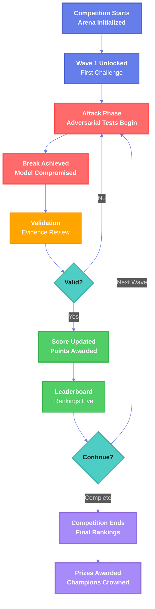

```mermaid
%%{init: {'theme': 'dark', 'themeVariables': { 'primaryColor': '#1e3c72', 'primaryBorderColor': '#667eea', 'primaryTextColor': '#e0e0e0', 'lineColor': '#667eea', 'secondBkgColor': '#2a1b4d', 'tertiaryColor': '#ff6b6b', 'tertiaryTextColor': '#fff', 'tertiaryBorderColor': '#ff8787', 'fontSize': '16px', 'fontFamily': 'arial'}}}%%
flowchart TD
    A["<b>Competition Starts</b><br/>Arena Initialized"] 
    B["<b>Wave 1 Unlocked</b><br/>First Challenge"]
    C["<b>Attack Phase</b><br/>Adversarial Tests Begin"]
    D["<b>Break Achieved</b><br/>Model Compromised"]
    E["<b>Validation</b><br/>Evidence Review"]
    F{"<b>Valid?</b>"}
    G["<b>Score Updated</b><br/>Points Awarded"]
    H["<b>Leaderboard</b><br/>Rankings Live"]
    I{"<b>Continue?</b>"}
    J["<b>Competition Ends</b><br/>Final Rankings"]
    K["<b>Prizes Awarded</b><br/>Champions Crowned"]
    
    A --> B
    B --> C
    C --> D
    D --> E
    E --> F
    F -->|Yes| G
    F -->|No| C
    G --> H
    H --> I
    I -->|Next Wave| C
    I -->|Complete| J
    J --> K
    
    style A fill:#667eea,stroke:#4f63d1,stroke-width:3px,color:#fff,font-weight:bold
    style B fill:#667eea,stroke:#4f63d1,stroke-width:2px,color:#fff
    style C fill:#ff6b6b,stroke:#ff5252,stroke-width:3px,color:#fff,font-weight:bold
    style D fill:#ff6b6b,stroke:#ff5252,stroke-width:3px,color:#fff,font-weight:bold
    style E fill:#ffa500,stroke:#ff9100,stroke-width:2px,color:#fff
    style F fill:#4ecdc4,stroke:#45b7aa,stroke-width:3px,color:#1a1a1a,font-weight:bold
    style G fill:#51cf66,stroke:#37b24d,stroke-width:3px,color:#fff,font-weight:bold
    style H fill:#51cf66,stroke:#37b24d,stroke-width:2px,color:#fff
    style I fill:#4ecdc4,stroke:#45b7aa,stroke-width:3px,color:#1a1a1a,font-weight:bold
    style J fill:#a78bfa,stroke:#9370db,stroke-width:3px,color:#fff,font-weight:bold
    style K fill:#a78bfa,stroke:#9370db,stroke-width:3px,color:#fff,font-weight:bold
```